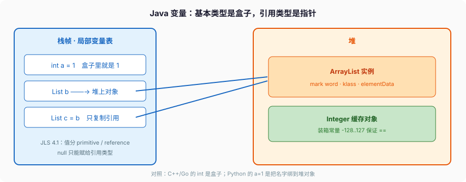
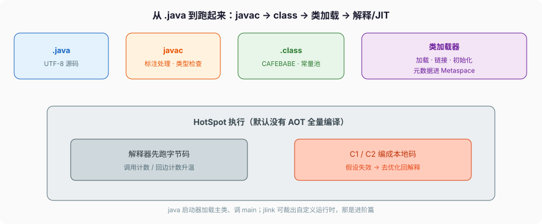

# Java入门

C++ 写 `int a = 1;`，编译器在当前栈帧开一块固定宽度的存储，把 `1` 写进去。Go 的 `var a int = 1` 同理：名字对应一块盒子。Python 写 `a = 1`，做的事情完全不同——堆上找（或 intern）一个 `int` 对象，再把名字 `a` 绑到这个对象上。

Java 两边都有。

```java
int a = 1;                 // 盒子。局部变量表里直接是 32 位 1
Integer boxed = 1;         // 引用。堆上（或缓存里）一个 Integer，变量里是指针
List<Integer> b = new ArrayList<>();
List<Integer> c = b;       // 复制引用，不是复制 ArrayList
```

JLS 21 §4.1 把类型劈成两类：**primitive types** 和 **reference types**。对应两种能放进变量、能当参数、能当返回值的数据：primitive values 和 reference values。另外还有一个没有名字的 **null type**，唯一的值是 `null`，不能声明「null 类型的变量」。

这不是风格问题。后面装箱缓存、`==` 踩坑、泛型不能写 `List<int>`、`synchronized` 锁的是对象头而不是 `int` 本身，全从这个劈法长出来。



Python 的 `b = a` 复制的是绑定；C++ 的 `int b = a` 复制的是位模式，`std::vector b = a` 是拷贝构造。Java 的 `int b = a` 跟 C++ 一样是拷位；`List c = b` 跟 Python 一样是拷引用。一门语言里两套规则同时生效，搞混的现场通常是「我以为 Integer 像 int」「我以为 new ArrayList 赋值会拷一份」。

---

## 一、变量是存储位置，不是标签

### 1、赋值语句在干什么

JLS §4.12 第一句：A variable is a **storage location** and has an associated type。赋值改的是这个位置里的值。

primitive 的值不和别的 primitive 共享状态（§4.2）。`int a = 1; int b = a; a = 2;` 之后 `b` 仍是 1——拷的是位模式。

reference 的值是指向对象的引用，或 `null`。`c = b` 拷的是引用。`b.add(1)` 两边都看见。这和 Go 的 slice 头拷贝、C++ 的指针拷贝是一类；和 `std::vector` 的拷贝构造、Go 的值类型 struct 赋值不是一类。

```java
int a = 1;
int b = a;
a = 2;
System.out.println(b);          // 1，盒子独立

List<Integer> xs = new ArrayList<>();
xs.add(1);
List<Integer> ys = xs;
xs.add(2);
System.out.println(ys);         // [1, 2]，同一份 ArrayList
System.out.println(xs == ys);   // true，同一个对象
```

想切断共享，必须显式拷贝：`new ArrayList<>(xs)` 是浅拷贝（元素还是那些 Integer）；嵌套结构要自己递归，没有 Python `copy.deepcopy` 那种一键。`List.copyOf(xs)`（10 起）产出不可变快照，再 `add` 抛 `UnsupportedOperationException`。

### 2、局部变量表的槽

局部变量在字节码里是局部变量表的槽。`int` / `float` / 引用占 1 槽，`long` / `double` 占 2 槽。对象本身在堆上。逃逸分析可能把未逃逸对象标量替换到栈/寄存器，那是 JIT 的优化，语言规则仍当它是堆对象——`==`、锁、身份哈希码按对象语义走。

方法参数：形参是新的存储位置，primitive 拷值，引用拷引用。没有 C++ 那种可 reseat 的 `T&`，也没有 Python「名字换绑」——你改不了调用方那个引用变量指向谁，只能顺着引用改对象。

```java
static void bumpInt(int n) {
    n++;                        // 改的是形参槽，调用方的 a 不动
}

static void bumpList(List<Integer> xs) {
    xs.add(1);                  // 改的是堆上的 list，调用方看见
}

static void reseat(List<Integer> xs) {
    xs = new ArrayList<>();     // 只改形参槽，调用方的引用不动
    xs.add(99);
}

public static void main(String[] args) {
    int a = 10;
    bumpInt(a);
    System.out.println(a);      // 10

    List<Integer> nums = new ArrayList<>();
    nums.add(10);
    bumpList(nums);
    System.out.println(nums);   // [10, 1]

    reseat(nums);
    System.out.println(nums);   // 仍是 [10, 1]，不是 [99]
}
```

Go 里 `func f(n int)` 是拷贝，`func f(s []int)` 拷贝的是 slice 头。Java 没有这层「有的引用类型其实是头拷贝、有的是深拷」——`ArrayList` 赋值永远是拷引用，要拷内容自己 `new ArrayList<>(src)`。

### 3、字段有默认值，局部没有

JLS §4.12.5 的默认值只给 **字段和数组元素**。局部变量没有默认值，使用前必须赋值，否则编译失败（definite assignment，§16）。

```java
class Box {
    int n;                      // 字段，默认 0
    String s;                   // 字段，默认 null
}

void f() {
    int n;
    // System.out.println(n);   // 编译失败，n 未赋值
    int[] arr = new int[3];
    System.out.println(arr[0]); // 0，数组元素有默认值
}
```

C++ 未初始化局部是 UB；Go 局部也是零值。Java 在局部上比 Go 严、比 C++ 安全。后端代码里看到「反正 int 是 0」只对字段成立，对局部不成立。

`final` 字段必须在每个构造器结束前赋上（或在声明处、实例初始化器里赋）。空白 `final` 局部必须在使用前沿每条路径都赋上，编译器按 definite assignment 检查，不是运行时才发现。

---

## 二、八种基本类型，宽度钉死

### 1、宽度是语言规则，不是 ABI 运气

JLS 规定的宽度（与 C++ 的「实现定义」相反，也与 Go 的 `int` 随架构变相反）：

| 类型 | 宽度 | 默认值（字段 / 数组元素，§4.12.5） |
| --- | --- | --- |
| `byte` | 8 位有符号 | `(byte)0` |
| `short` | 16 位有符号 | `(short)0` |
| `int` | 32 位有符号 | `0` |
| `long` | 64 位有符号 | `0L` |
| `char` | 16 位无符号 UTF-16 code unit | `'\u0000'` |
| `float` | 32 位 IEEE 754 | `0.0f` |
| `double` | 64 位 IEEE 754 | `0.0d` |
| `boolean` | 语言层不是「1 位」，JVM 里常用 1 字节 | `false` |

引用类型默认值是 `null`。

整数运算的类型提升：`byte` / `short` / `char` 的算术先变成 `int`。`byte a = 1; byte b = 2; byte c = a + b;` 编译失败，得 `(byte)(a + b)`。这不是吹毛求疵，循环里 `byte` 当计数器每次都在做隐藏的转换。

字面量：`1` 是 `int`，`1L` 是 `long`，`1.0` 是 `double`，`1.0f` 是 `float`。`long x = 1 << 31;` 先按 `int` 算出 `-2147483648` 再拓宽，要 `1L << 31`。移位右边只看低 5 位（int）或低 6 位（long），`1 << 32` 等于 `1 << 0`，不是 0。

### 2、`char` 不是一个字

`char` 是 UTF-16 的一个 code unit。emoji、部分汉字在 UTF-16 里是 surrogate pair，两个 `char`。`String.length()` 返回的是 code unit 数，不是用户看到的字数。

```java
String face = "😀";                 // U+1F600，UTF-16 两个 char
System.out.println(face.length());  // 2
System.out.println(face.codePointCount(0, face.length())); // 1
System.out.println(face.charAt(0)); // 高代理，不是一个完整字符

int[] cps = face.codePoints().toArray();
System.out.println(cps.length);     // 1
```

要按用户感知遍历，用 `codePoints()` 或 `Character.charCount`。截断字符串按 `length()` 砍，可能把 surrogate pair 劈开，后面解码变乱码。Go 的 `range string` 按 rune；Python 3 的 `len(s)` 按 Unicode 码点（不是 grapheme）。Java 的 `String` 底层是 UTF-16，API 默认暴露 code unit。

Java 9 起 HotSpot 对纯 Latin-1 的字符串用单字节数组存（compact strings，`coder = LATIN1`），混了非 Latin-1 才用 UTF-16。`length()` 的语义不变：仍是 char 的个数。这是实现，不是 JLS 改了 `char`。

### 3、有符号溢出不是 UB

整数溢出：有符号整数运算按补码绕回，**不是** C++ 那种有符号溢出 UB。`Integer.MAX_VALUE + 1 == Integer.MIN_VALUE`。`Math.addExact` 才会在溢出时抛 `ArithmeticException`。

```java
int x = Integer.MAX_VALUE;
System.out.println(x + 1);          // Integer.MIN_VALUE，静默绕回
System.out.println(Math.addExact(x, 1)); // ArithmeticException
```

金钱、库存、分页偏移，绕回是事故。要么 `addExact`，要么更大的类型，要么 `BigInteger`。不要靠「我们量到不了 2^31」。

除零：整数 `/ 0`、`% 0` 抛 `ArithmeticException`。浮点 `/ 0.0` 是 `Infinity` 或 `NaN`，不抛。`0.0 / 0.0` 是 `NaN`。`NaN == NaN` 为 false，要用 `Double.isNaN`。

### 4、浮点和钱

`0.1 + 0.2` 不等于 `0.3`，这是二进制浮点，不是 Java 独有。钱用 `BigDecimal`，构造时用 `new BigDecimal("0.1")` 或 `BigDecimal.valueOf(1, 1)`，不要用 `new BigDecimal(0.1)`——后者把已经圆过的 `double` 再精确化，更错。

```java
System.out.println(0.1 + 0.2 == 0.3);                    // false
System.out.println(new BigDecimal(0.1));                 // 0.10000000000000000555...
System.out.println(new BigDecimal("0.1"));               // 0.1
System.out.println(new BigDecimal("0.1").add(new BigDecimal("0.2")));
                                                         // 0.3
```

`BigDecimal` 的 `equals` 比的是值和标度：`0.1` 和 `0.10` 不相等。比数值用 `compareTo`。`setScale` 必须给舍入模式，否则可能 `ArithmeticException`。

### 5、`boolean` 不能和整数互转

没有 C 那种 `if (n)`。`if (n != 0)` 必须写出来。`boolean` 不是 0/1，不能丢进算术。`true` / `false` 装箱成 `Boolean.TRUE` / `FALSE`，身份规范保证 `==`。

---

## 三、装箱：值相等，身份不一定相等

### 1、自动装箱是 `valueOf`，不是 `new`

自动装箱是 boxing conversion（JLS §5.1.7）。`Integer x = 1;` 语义上等价于 `Integer.valueOf(1)`，不是 `new Integer(1)`（后者在 9 起 deprecated，21 里构造器仍在但不要用）。

拆箱是 `intValue()`。`Integer x = null; int y = x;` 拆箱 NPE。

### 2、IntegerCache：规范保证的那段，和 HotSpot 多缓存的那段

规范对 **常量表达式** 的装箱身份有硬保证：

- `boolean` 的 `true` / `false`
- `char` 在 `'\u0000'` 到 `'\u007f'`
- `byte` / `short` / `int` / `long` 在 **-128 到 127**

任意两次装箱，结果必须 `==`。这是语言规则，不是「HotSpot 碰巧缓存」。实现可以缓存更多，但 **你不能依赖 128 也 `==`**。

OpenJDK 21 的 `Integer.valueOf(int)`：

```java
public static Integer valueOf(int i) {
    if (i >= IntegerCache.low && i <= IntegerCache.high)
        return IntegerCache.cache[i + (-IntegerCache.low)];
    return new Integer(i);
}
```

`IntegerCache.low` 钉死 **-128**。`high` 默认 127，可以用 `-XX:AutoBoxCacheMax` 或内部属性 `java.lang.Integer.IntegerCache.high` 抬上去，源码里有一句 `assert IntegerCache.high >= 127`——不能缩小到小于 127，那会违反 JLS。缓存数组在类初始化时填好，CDS 归档时整段放进共享堆，身份在归档前后必须一致，所以初始化之后不能再往 cache 数组里塞新的 `Integer`。

```java
Integer a = 127;
Integer b = 127;
System.out.println(a == b);      // true，规范保证

Integer c = 128;
Integer d = 128;
System.out.println(c == d);      // 未规定。HotSpot 默认 false
System.out.println(c.equals(d)); // true，比的是 int 值

Integer e = new Integer(127);
Integer f = 127;
System.out.println(e == f);      // false。new 出来的不进缓存
```

比较包装类型一律 `equals`，或先拆箱再比 primitive。`==` 对引用是身份；对 primitive 是值。两边类型不一致时会拆箱。

### 3、拆箱 NPE 是真实事故

```java
Integer x = null;
if (x == 1) { }                  // NPE：拆箱再比
if (x != null && x == 1) { }     // 短路，安全
if (Integer.valueOf(1).equals(x)) { }  // false，equals 对 null 返回 false
```

`map.get(k)` 返回 `Integer`，你写 `int n = map.get(k);`，key 不在时 NPE，不是得到 0。CHM 不允许 null value，HashMap 允许，两种 Map 在这里行为不同——集合篇展开。

三元运算符两边类型不一致会装箱或拆箱，类型推错也会 NPE：

```java
boolean flag = true;
Integer n = null;
Integer r = flag ? n : 0;        // 0 是 int，n 被拆箱，NPE
Integer s = flag ? n : Integer.valueOf(0); // 两边都是 Integer，s 是 null
```

### 4、泛型、集合、热路径

`int` 和 `Integer` 在泛型、集合里不是一回事。`List<int>` 非法（擦除后要成 `List` 的元素类型，primitive 不是引用）。`List<Integer>` 合法，每个元素一次装箱。高频计数用 `int[]` 或第三方原始集合，不要用 `ArrayList<Integer>` 当热路径。

`Integer[]` 是引用数组，元素默认 `null`。`int[]` 元素默认 0。把 `int[]` 当 `Object[]` 用会编译失败——primitive 数组不是 `Object[]` 的子类型，虽然它自己是对象（`int[].class` 存在）。

---

## 四、从源码到 `main`

### 1、javac 产出的不是机器码

```
Hello.java  --javac-->  Hello.class  --java Hello-->  类加载 / 解释 / JIT
```



`javac` 产出的 class 文件魔数是 `CAFEBABE`（JVMS §4.1）。里面是常量池和字节码，不是机器码。`javap -c -p Hello` 能看见 `iload` / `istore` / `invokevirtual`。`java` 启动器找到主类、加载、链接、初始化，再调 `public static void main(String[])`。没有这个方法，`NoSuchMethodError`。

包名必须和目录对应：`package com.foo;` 的源文件在 `com/foo/` 下。没写 `package` 的类在未命名包，别的包 import 不了它——所以生产代码必须有包名。`module-info.java` 是模块，进「类加载与模块」篇。

### 2、解释器先跑，热了才编

HotSpot 默认先解释。方法调用次数、循环回边次数到阈值，C1（客户端编译器）/ C2（服务端）编成本地码。类型假设失效会 **去优化** 回解释，再编。所以「Java 慢」如果指启动后稳态，多数时候已经在跑本地码；如果指第一次请求，解释 + 类加载才是账。

分层编译（21 默认开）：C1 先出带剖析的码，C2 再出更狠的优化。`-XX:-TieredCompilation` 能关，生产上没理由关。Graal 作为 JIT 是另一条路，21 不是默认。AOT（`jaotc`、Graal native-image）不是这篇的范围。

`jshell` 是 REPL，21 里用来试语法可以，不当生产入口。单文件 `java Hello.java`（11 起）内部仍是编译再跑，省略的是你自己调 `javac`。源文件里只能有一个公开顶层类，文件名必须对上。

### 3、classpath 不是「找到就行」

`java -cp out:lib/foo.jar com.foo.App` 按顺序搜。同名类谁先被定义加载器 define，就是谁。两个 jar 里都有 `com.foo.Util`，classpath 顺序决定你用哪份——这是依赖冲突的现场，不是「Java 会自动选新的」。模块路径是另一套，类加载篇讲。

---

## 五、字符串：不可变，字面量进池

### 1、字面量、`new`、`intern`

`String` 是 class，值是引用。字面量 `"hi"` 在类加载时进入字符串常量池，相同字面量 `==`。`new String("hi")` 在堆上另造一个，内容相同身份不同。`intern()` 把堆上的塞进池并返回池里那份。

```java
String a = "hi";
String b = "hi";
System.out.println(a == b);              // true，同一份字面量

String c = new String("hi");
System.out.println(a == c);              // false
System.out.println(a == c.intern());     // true
System.out.println(a.equals(c));         // true
```

不要用 `==` 比 `String`。`equals` 比 UTF-16 内容（compact string 下 Latin-1 按字节比，语义仍是按 char）。`equalsIgnoreCase` 按 locale 无关的大小写折叠，土耳其 locale 的 `i` 有坑，用户可见文本用 `Collator`。

### 2、`+` 和 StringBuilder

`StringBuilder` 可改；`StringBuffer` 方法带 `synchronized`，单线程用 Builder。循环里 `s = s + x` 每次新 `String`，javac 对 **编译期能看见的** `+` 链会改成 `StringBuilder`，循环里的 `+` 不会自动帮你抽到循环外。

```java
String s = "";
for (int i = 0; i < n; i++) {
    s = s + i;                  // 每次分配，O(n²)
}
StringBuilder sb = new StringBuilder();
for (int i = 0; i < n; i++) {
    sb.append(i);               // 均摊 O(n)
}
```

`String.formatted` / `formatted` 文本块（15 正式）适合多行 SQL、JSON 样例。文本块里的换行是内容的一部分，`stripIndent` 规则按最小公共缩进剥。

### 3、不可变，所以能当 key

`String` 不可变：任何「修改」都是新对象。所以它可以当 `HashMap` 的 key——内容不变，hashCode 稳定。OpenJDK 的 `String` 会把算过的 hash 缓存在字段里，第一次 `hashCode()` 之后是 O(1)。自己写的可变类当 key，见集合篇。

空串 `""` 和 `new String()` 内容相等，身份不一定相同。`isEmpty()` 比 `length() == 0` 可读，语义一样。`isBlank()`（11）把空白字符也当空。

---

## 六、数组是对象，协变，运行时会查

### 1、`length` 是字段

`String[]` 是引用类型，也是对象，有 `length` 字段（不是方法）。`new int[3]` 三个元素默认 0；`new String[3]` 三个 `null`。`arr[arr.length]` 是 `ArrayIndexOutOfBoundsException`，不是 C 那种越界 UB。

数组一旦 `new` 出来，长度钉死。要变长用 `ArrayList`。`Arrays.copyOf` 是再分配一块。

### 2、协变是语言规则，也是坑

数组协变：`String[]` 是 `Object[]` 的子类型。

```java
Object[] arr = new String[1];
arr[0] = Integer.valueOf(1);   // 编译过，运行 ArrayStoreException
```

这是 JLS 点名的「赋值兼容性在数组上要做运行时检查」（§10.5）。每个数组对象记得自己的分量类型，`aastore` 字节码会查。泛型故意做成 **不变**（`List<String>` 不是 `List<Object>` 的子类型），就是为了把这类错误提前到编译期。`List` 没有协变这个口。

`Arrays.asList(arr)` 返回的是固定大小的数组视图，`set` 可以，`add`/`remove` 抛 `UnsupportedOperationException`。要可变 `List`，`new ArrayList<>(Arrays.asList(...))`，或 9 起 `List.of`（不可变、不允许 null）。

多维数组是数组的数组：`int[][] m = new int[2][]; m[0] = new int[3];` 行可以不同长。`new int[2][3]` 一次把两层都分配完。

---

## 七、完整走一遍：从一行赋值到跑起来

下面这段，按规范把每一步钉死。不是「大概会编译」，是字节码和运行时各自干什么。

```java
package com.aqjszz.demo;

public class Demo {
    public static void main(String[] args) {
        int n = 127;
        Integer a = n;
        Integer b = 127;
        Integer c = 128;
        Integer d = 128;
        System.out.println(a == b);     // true
        System.out.println(c == d);     // 默认 false
        System.out.println(c.equals(d));// true

        String s = "hi";
        String t = new String("hi");
        System.out.println(s == t);     // false
        System.out.println(s == t.intern()); // true

        Object[] arr = new String[1];
        try {
            arr[0] = 1;                 // 装箱成 Integer，再 aastore，炸
        } catch (ArrayStoreException e) {
            System.out.println("store");
        }
    }
}
```

1. `javac` 把 `Integer a = n;` 编成 `invokestatic Integer.valueOf`。`Integer b = 127;` 是常量，同样 `valueOf`。`arr[0] = 1;` 先 `valueOf(1)` 再 `aastore`。
2. `java com.aqjszz.demo.Demo`：bootstrap 加载 `java.lang.Object` / `String` / `Integer`，应用加载器加载 `Demo`。`Integer` 的 `<clinit>` 填 `IntegerCache`。
3. `valueOf(127)` 走 cache，`a` 和 `b` 同一份对象。`valueOf(128)` 默认 `new Integer` 两次，`c` 和 `d` 身份不同。
4. `"hi"` 在 `Demo` 的常量池里，类加载时 intern。`new String("hi")` 堆上另造，`intern()` 返回池里那份。
5. `new String[1]` 的分量类型是 `String`。`aastore` 发现要存的是 `Integer`，抛 `ArrayStoreException`。异常是对象，堆上分配，栈展开找到 `catch`。

把这段 `javap -c` 一遍，比背「装箱缓存范围」记得牢。

---

## 八、控制流、方法描述符、javap、classpath 谁赢

### 1、definite assignment 管的是路径，不是「看起来赋过」

```java
int x;
if (flag) x = 1;
else x = 2;
System.out.println(x);           // 合法，两条路径都赋了

int y;
if (flag) y = 1;
System.out.println(y);           // 编译失败，false 路径没赋

int z;
while (true) { z = 1; break; }
System.out.println(z);           // 合法，编译器看懂了必进循环体再 break
```

`if (true)` 的死代码规则和 definite assignment 搅在一起：编译器按常量条件裁路径。`boolean flag` 不是编译期常量，false 分支必须赋。`switch` 表达式穷尽才保证有值；老 `switch` 语句漏 case 再读变量，同样编译失败。

`for (int i = 0; i < n; i++)` 的 `i` 作用域只在循环。增强 for 是 iterator，集合篇的 fail-fast 从这里长出来。

### 2、方法描述符是字节码里的真名

`int add(int a, String s)` 的描述符是 `(ILjava/lang/String;)I`。`void main(String[] args)` 是 `([Ljava/lang/String;)V`。`Integer.valueOf(int)` 是 `(I)Ljava/lang/Integer;`。

重载靠描述符区分，不是靠参数名。擦除后 `void f(List<String>)` 和 `void f(List<Integer>)` 描述符都是 `(Ljava/util/List;)V`，所以不能这么重载。`javap -s` 打描述符，`-c` 打字节码。

### 3、javap 把装箱对到 `valueOf`

```java
static Integer box(int n) {
    return n;
}
```

`javap -c -p` 看见的不是「语法糖」三个字，是：

```text
invokestatic #2  // Method java/lang/Integer.valueOf:(I)Ljava/lang/Integer;
areturn
```

`Integer a = 127; Integer b = 127; a == b` 两边都是 `valueOf`，进 cache。`new Integer(127)` 是 `new` + `invokespecial <init>`，不进 cache。把这段编出来自己看一遍，比背「-128 到 127」记得牢。

拆箱是 `invokevirtual Integer.intValue`。`Integer x = null; int y = x;` 就是在这条 `intValue` 上 NPE。

### 4、classpath 同名类：谁先被 define 谁赢

`java -cp a.jar:b.jar com.shop.App`。两个 jar 都有 `com.shop.Util`，应用加载器按 classpath **顺序** 找，先找到的那份 `defineClass`，另一份永远不会成为这个加载器下的 `Util`。没有「自动选新版本」。模块路径上同名还可能直接失败（分裂包）。

冲突的现场是依赖树里两份传递依赖，不是「Java 坏了」。`jdeps` / 构建工具的 dependency tree 把谁先放进 classpath 查清，不要靠重启碰运气。

---

## 九、和三门语言对照，钉死

| | C++ | Go | Python | Java |
| --- | --- | --- | --- | --- |
| `int` 名字 | 盒子 | 盒子（`int` 宽度随架构） | 标签，绑堆上任意精度 int | 盒子，固定 32 位 |
| `obj` 赋值 | 看类型：值拷 / 指针拷 | 值拷；slice/map/chan 拷头 | 复制绑定 | 复制引用 |
| 局部未赋值 | UB | 零值 | 运行时 NameError | 编译失败 |
| 有符号溢出 | UB（通常绕回） | 静默绕回 | 变更大的 int | 补码绕回，不是 UB |
| 空 | 指针 nullptr；引用不能空 | `nil` 对指针/slice/interface | `None` 是对象 | 只有引用能 `null`，拆箱 NPE |
| 字符串 | `std::string` 可变 | `string` 不可变，字节 | 不可变，码点 | 不可变，UTF-16 code unit |
| 数组越界 | UB | panic | IndexError | `ArrayIndexOutOfBoundsException` |

---

## 十、反模式

- 用 `==` 比 `Integer` / `String`。
- `new Integer(n)`。走 `valueOf` 或自动装箱。
- 局部变量依赖「反正是 0」。字段才有默认值。
- 热路径 `List<Integer>` 做算术。
- `char` 当「一个字」；按 `length()` 截断 Unicode。
- 主类塞未命名包，然后奇怪为什么别人 import 不了。
- `new BigDecimal(0.1)` 当钱。
- `int n = map.get(k);` 不看 get 是否 null。
- 三元运算符一边 `Integer` 一边 `int`，拆箱 NPE。
- 靠「我本地 `128 == 128` 是 true」写业务——那是你把 `AutoBoxCacheMax` 抬过了 128，换台机器就碎。

下一篇把 class、interface、record、enum、分派和 `equals`/`hashCode` 钉完。类型体系对了，对象模型才能谈。
