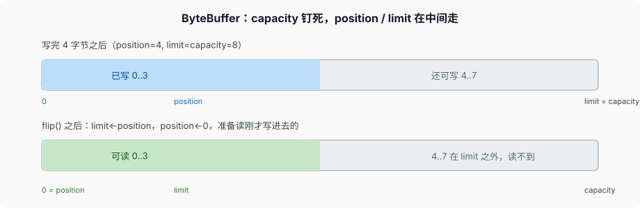

# 异常与 I/O

JLS §11.1.1 把异常类分成两堆：

- **unchecked**：`RuntimeException` 及其子类，加上 `Error` 及其子类。编译器不强迫你写 `throws` 或 `catch`。
- **checked**：`Throwable` 的其余子类。也就是 `Exception` 里除掉 `RuntimeException` 的那一支。

`Error` 单独挂在 `Throwable` 下，不在 `Exception` 下，就是为了让 `catch (Exception e)` 接不住 `OutOfMemoryError` / `StackOverflowError`。普通代码不该恢复 `Error`。

`Throwable` 不能是泛型类（§8.1.2）。所以没有 `class Fail<T> extends Exception`。

C++ 异常不区分 checked；Python 全是运行时；Go 用 `error` 返回值，调用方看见。Java 把「调用方必须看见」做成了类型系统的一部分。讨厌它的人很多，规则仍然是规则。

---

## 一、checked 是方法契约

### 1、throws 写进签名

方法要抛 checked，必须写进 `throws`，否则编译失败。覆盖方法的 `throws` **不能新增** 父方法没有声明的 checked（§8.4.8.3）。父方法 `throws IOException`，子方法可以只抛 `FileNotFoundException`（更窄），不能改抛 `SQLException`。

lambda / 函数式接口同一条：`Runnable.run()` 不抛 checked，lambda 体里不能把 checked 往外抛，只能在内部 catch，或自己定义会抛 checked 的函数式接口。

### 2、什么用 checked，什么用 unchecked

对 **可恢复、调用方不处理就是 bug** 的失败用 checked（`IOException`、`InterruptedException` 在阻塞 API 上）。对 **编程错误** 用 unchecked（`IllegalArgumentException`、`NullPointerException`、`IllegalStateException`、`IndexOutOfBoundsException`）。

不要用 checked 包一层再变成 `RuntimeException` 只为了少写 `throws`，除非你在框架边界、文档写明「全部改非检查」。乱包会把契约藏起来。Spring 把 JDBC 的 `SQLException` 翻成 `DataAccessException`（unchecked），那是框架边界的明确选择，不是业务代码的默认动作。

自己定义异常：checked 继承 `Exception`（别直接继承 `Throwable`），unchecked 继承 `RuntimeException`。带 cause 的构造器要调 `super(msg, cause)`，否则 `getCause()` 是 null，排障丢根。

### 3、`InterruptedException` 不是普通 checked

吞掉它等于把中断状态扔了。阻塞 API（`Thread.sleep`、`Object.wait`、`BlockingQueue.take`、`Future.get`）被中断时清掉中断标记、抛这个异常。正确做法：捕获后 `Thread.currentThread().interrupt()` 再决定返回或改抛。虚拟线程同样走这套中断模型（JEP 444）。

```java
try {
    queue.take();
} catch (InterruptedException e) {
    Thread.currentThread().interrupt();
    throw e;                            // 或 return，但标记得在
}
```

空 `catch (InterruptedException e) {}` 让上层 `Thread.interrupted()` 看见 false，取消链路断掉。这是生产里线程停不下来的常见原因。

`Thread.stop` 在 21 里是死 API（会抛 `UnsupportedOperationException`）。取消只走中断。

---

## 二、异常对象本身

### 1、栈轨迹何时拍

`new RuntimeException()` 的时候就填栈轨迹，不是 throw 的时候。所以「先造好一个异常当哨兵反复 throw」看到的是构造点，不是 throw 点。热路径不要 `throw new` 当控制流——填栈轨迹要 walk 栈，贵。

`fillInStackTrace` 可以重拍。`Throwable` 构造器有个 `writableStackTrace` 参数，框架可以关掉填栈。

`getStackTrace()` 返回副本。`printStackTrace` 默认打到 `System.err`，生产上等于丢日志系统外面。

### 2、cause 和 suppressed

`e.getCause()` 是被包装的那一个。`addSuppressed` 是 try-with-resources 的 close 异常走的路。打印栈轨迹时 suppressed 会跟在主异常后面，标 `Suppressed:`。自己 catch 之后再 throw 另一个，要用 `new XxxException(msg, e)` 把 e 当 cause，不要 `throw new XxxException(e.getMessage())` 把栈和类型丢掉。

`throw e;` 不会重填栈。`throw (Exception) e.fillInStackTrace();` 会。一般不要重填，排障靠原始栈。

### 3、不要用异常做控制流

`Integer.parseInt` 对脏输入抛 `NumberFormatException`。循环里对每条脏数据都 parse 再 catch，比先校验慢一个数量级。校验用 `indexOf`、正则、或自己扫字符。

`Class.forName` 找不到是 `ClassNotFoundException`（checked）。JVM 解析符号引用找不到是 `NoClassDefFoundError`。两者不是一回事，类加载篇展开。

---

## 三、try-with-resources

### 1、关闭顺序和 suppressed

`AutoCloseable.close()` 允许抛 `Exception`。`Closeable.close()` 收窄成 `IOException`，并且文档要求幂等：先释放底层资源、标成已关，再抛；**不要在 close 里抛 `InterruptedException`**，它被抑制时会和中断状态纠缠。

```java
try (InputStream in = Files.newInputStream(path);
     OutputStream out = Files.newOutputStream(dst)) {
    in.transferTo(out);
}
```

声明顺序：先 `in` 后 `out`。关闭顺序 **反着来**：先 `out.close()` 再 `in.close()`。体里抛的异常是主异常；close 抛的进 `getSuppressed()`。这是语言规则（JLS §14.20.3），不是「最好如此」。

javac 大致编成：

```text
资源赋值
try {
    体
} finally {
    若资源 != null: close
    若体抛过且 close 再抛: addSuppressed
}
```

多个资源就是嵌套的 finally，从后往前关。

### 2、有效 final 的已有变量

Java 9 起 try 括号里可以放有效 final 的已有变量：`try (in)`，不再强制声明。资源仍会关。别把别人还要用的流塞进去。

`close` 应当幂等。流已经关了再关，不该炸。`FilterOutputStream` 历史上 close 会再 flush，flush 失败时可能把流留在半关——用具体实现时看文档。

不要把 `Stream`（`java.util.stream`）一律套 try-with-resources。文档写了：纯内存流没资源；包着 I/O 的（`Files.lines`）才需要关。乱关没有 I/O 的 stream 只是噪音。

### 3、finally 里 return 会吞异常

```java
try {
    throw new IOException("body");
} finally {
    return;                         // body 的异常被吞掉
}
```

finally 里 `return` / `throw` 会替换体里正在传播的异常。try-with-resources 用 suppressed 就是为了避免这条老坑。自己写 finally 不要 return。

---

## 四、NIO.2：路径和字节，不是 `File` 字符串拼接

### 1、Path 不是文件

`java.io.File` 还在，新代码用 `java.nio.file.Path` / `Files` / `FileSystem`。

- `Path` 是路径，不保证文件存在。`Files.exists` 有 TOCTOU，存在了立刻删你也拦不住。
- `Paths.get` 和 `Path.of`（11）等价。相对路径相对的是 JVM 的 user.dir，不是 class 所在目录。
- `resolve` / `relativize` / `normalize` 是路径运算，不碰盘。`normalize` 不处理符号链接，要真实路径用 `toRealPath`。
- `Files.readAllBytes` / `readString`（Java 11+）适合小文件。大文件用 `newInputStream` + 缓冲，或 `FileChannel`。
- `Files.lines` 返回的 `Stream<String>` **必须关**，背后是文件描述符。
- 默认 `StandardCharsets.UTF_8` 写清楚，不要依赖 `Charset.defaultCharset()`（跟 OS、跟 JVM 启动参数，21 在某些平台已默认 UTF-8，仍写明白）。
- `Files.move` / `copy` 的 `REPLACE_EXISTING`、`ATOMIC_MOVE` 不是处处能原子。同一 `FileSystem` 上 `ATOMIC_MOVE` 才可能；跨盘会抛 `AtomicMoveNotSupportedException`。
- `Files.walk` 也要关。符号链接默认不跟随，`FOLLOW_LINKS` 要自己防环。

`FileChannel` 能 `force(true)` 把内容和元数据刷到盘。数据库、WAL 才需要想这个。普通业务拷文件，`InputStream.transferTo` 够。

### 2、阻塞和虚拟线程

阻塞 I/O 在平台线程上会占住那条 OS 线程。虚拟线程在 **Java 21** 里，多数阻塞 File/Socket API 会卸载虚拟线程；`synchronized` 仍可能把虚拟线程钉在 carrier 上（JEP 444 原文；后续版本在解钉，21 按 21 说）。部分文件系统调用也不卸载。I/O 模型选虚拟线程时，锁用 `java.util.concurrent` 的锁，少在热路径 `synchronized`。

`java.io` 的流大多有内部锁。虚拟线程上用 `InputStream.read` 可能钉住。NIO 通道本身不 `synchronized`。新代码偏 NIO.2。

---

## 五、ByteBuffer：四个指针，不是一块随便读写的数组

NIO 通道读写不直接吃 `byte[]`，吃 `ByteBuffer`。类文档把缓冲区状态钉成四个索引：

- `capacity`：这块有多大，分配时钉死
- `limit`：第一个不能读写的下标
- `position`：下一个要读写的下标
- `mark`：`reset` 回去的位置，未定义时 `reset` 抛 `InvalidMarkException`

不变量：`0 ≤ mark ≤ position ≤ limit ≤ capacity`。



```java
ByteBuffer buf = ByteBuffer.allocate(8);
buf.put((byte) 1).put((byte) 2).put((byte) 3).put((byte) 4);
// position=4, limit=8：还能写 4 字节

buf.flip();
// limit←旧 position（4），position←0：只能读刚才写进去的 4 字节

while (buf.hasRemaining()) {
    byte b = buf.get();
}
buf.compact();   // 没读完的挪到下标 0，position 设到剩余长度，limit=capacity，接着写
buf.clear();     // position=0, limit=capacity。不清内存，只改指针
buf.rewind();    // position=0，limit 不动，再读一遍
```

`flip` 是写完转读。`clear` 是读完（或不要了）转写整块。`compact` 是「读了一半，剩下的当新内容的前缀继续写」。三者不是同义词。忘了 `flip`、对着刚写完的 buffer 做 `channel.write`，写出的是 position 到 limit 的空段，文件里什么都没有。这是 NIO 入门第一坑。

`channel.write` **不保证一次写完**。必须循环：

```java
buf.flip();
while (buf.hasRemaining()) {
    channel.write(buf);
}
```

Socket 上尤其如此。读同理，`read` 返回 0 不一定结束，返回 -1 才是 EOF。

`allocate` 在堆上，数组能 `array()` 拿出来。`allocateDirect` 在堆外，减少一次用户态拷贝，分配和释放更贵，适合长寿命、反复给通道用的缓冲。直接缓冲没有 `array()`，`hasArray()` 为 false。直接缓冲的回收靠 GC 或 `Cleaner`，短生命周期反复 `allocateDirect` 会把堆外打满。

`ByteOrder` 默认 `BIG_ENDIAN`，和网络字节序一致；和本地内存布局打交道再 `order(ByteOrder.nativeOrder())`。`asIntBuffer` 视图从当前 position 起，两个 buffer 共享内容、独立的 position/limit。

`slice` / `duplicate` 共享底层存储。改一个另一个看见。`asReadOnlyBuffer` 写出抛 `ReadOnlyBufferException`。

---

## 六、`catch` 的顺序和多 catch

先子类后父类。`catch (Exception e)` 写在 `catch (IOException e)` 前面，编译失败。

`catch (IOException | SQLException e)`：`e` 实质 final，不能再赋。两个类型的最小共同超类是 `Exception`，对该变量只能调两者都有的方法。

不要 `catch (Throwable t)` 除非在线程顶。`catch (Exception e)` 已经接不住 `Error`，这是层次故意的。线程顶的 `UncaughtExceptionHandler` 才是接 `Error` 打日志的地方，接了也不要「恢复」OOM。

`catch` 之后吞掉不记日志，等于故障消失。至少打 cause 和上下文（哪条路径、哪个 id）。

---

## 七、完整走一遍：拷文件时 close 失败

```java
Path src = Path.of("a.bin");
Path dst = Path.of("b.bin");
try (InputStream in = Files.newInputStream(src);
     OutputStream out = Files.newOutputStream(dst)) {
    in.transferTo(out);
    throw new IOException("body failed after copy");
}
```

1. `in` 先声明，`out` 后声明。
2. `transferTo` 把字节从 in 拷到 out。体再抛 `IOException("body failed after copy")`。
3. 离开 try，先 `out.close()`。假如 close 因 flush 失败再抛 `IOException("flush")`，它进主异常的 `getSuppressed()`。
4. 再 `in.close()`。再失败同样 suppressed。
5. 传播出去的是 body 那条，`printStackTrace` 能看见 `Suppressed: java.io.IOException: flush`。

如果不用 try-with-resources，手写 `out.close()` 在 finally 里再抛，body 的异常就被冲掉，排障只看见 flush。这就是语言要把 suppressed 做成规则的原因。

`transferTo` 对 `FileInputStream` 会尝试 `FileChannel.transferTo` 零拷贝，失败再回落到用户态循环。这是实现优化，语义仍是拷完所有字节或抛。

---

## 八、反模式

- `e.printStackTrace()` 当错误处理。
- `catch (Exception e) { throw new RuntimeException(e); }` 无说明地剥掉 checked。
- `catch (InterruptedException e) {}` 空。
- `new FileInputStream` 不关。用 try-with-resources。
- 依赖默认 charset。
- 用 `File.renameTo` 当原子提交。返回 `boolean` 还不抛原因；换 `Files.move`。
- `channel.write(buf)` 之前忘了 `flip`。
- 把 `clear` 当「把内容填零」。它只改指针。
- `channel.write` 只调一次就当写完。
- finally 里 `return`。
- 热路径 `throw new` 当分支。

基础四篇到此。进阶从内存模型开始：没有 happens-before，上面这些对象在两个线程之间读到什么，规范不保证。
