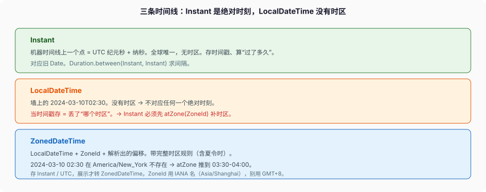

# 日期与时间

```java
static final SimpleDateFormat FMT = new SimpleDateFormat("yyyy-MM-dd HH:mm:ss");

String format(Date d) {
    return FMT.format(d);   // 多线程共享这一个 FMT
}
```

压测一上并发，`format` 时不时返回乱掉的日期、甚至抛 `NumberFormatException` / `ArrayIndexOutOfBoundsException`。`SimpleDateFormat` 的 Javadoc 一句话钉死原因：**Date formats are not synchronized.** 它内部有一个可变的 `Calendar` 字段，`format` 分几步往这个字段读写中间状态，两个线程一起搓同一个 `Calendar`，结果就是脏读。

这篇把日期时间走一遍：为什么 `java.time` 全是不可变值类型、三条时间线（Instant / LocalDateTime / ZonedDateTime）各表示什么、`Duration` 和 `Period` 差在哪、时区和夏令时的坑、`DateTimeFormatter` 为什么能当 `static final` 而 `SimpleDateFormat` 不能。事实对 `java.time` 包文档与 JDK 21 Javadoc。

---

## 一、旧 API 错在可变

`java.util.Date` / `Calendar` 的问题不是「老」，是 **可变 + 设计反直觉**：

- `Date` 可变，`setTime` 能就地改，传出去别人能改你的。
- `Date` 的 `getYear()` 返回「年份 - 1900」，`getMonth()` 是 0–11。`new Date(2024, 0, 1)` 不是 2024 年，是 3924 年（构造器也 -1900，且这些方法已 deprecated）。
- `Calendar.MONTH` 从 0 开始，`Calendar.JANUARY == 0`。`cal.set(2024, 12, 1)` 是 2025 年 1 月，不是 12 月。
- `SimpleDateFormat` 可变、非线程安全。

`java.time`（JSR-310，Java 8 起）整包重做：包文档第一句——**All the classes are immutable and thread-safe.** 每个「修改」方法返回新对象，月份是 1–12（`Month.JANUARY.getValue() == 1`）。这不是 API 换皮，是把「时间是值」这件事做对了。

---

## 二、三条时间线：Instant、LocalDateTime、ZonedDateTime

初学最大的混乱是把这三个当同一种东西。它们表示的时间 **不一样**：



| 类型 | 表示 | 有时区吗 | 对应旧 API | 用在哪 |
| --- | --- | --- | --- | --- |
| `Instant` | 机器时间线上的一个点，UTC 纪元秒 + 纳秒 | 无（就是 UTC） | `Date` | 存时间戳、日志、DB、算「过了多久」 |
| `LocalDateTime` | 墙上的日期 + 时间，`2024-03-10T02:30` | **无** | 无 | 「每天 2:30 执行」这种挂历时间 |
| `ZonedDateTime` | 某个时区里的一个完整时刻 | 有（`ZoneId` + 解析出的偏移） | `GregorianCalendar` | 要按时区精确算、跨时区展示 |

`LocalDateTime` **没有时区**，所以它 **不对应任何一个绝对时刻**。`2024-03-10T02:30` 在北京和在纽约是两个不同的物理瞬间。把 `LocalDateTime` 当时间戳存，等于丢了「哪个时区」这条信息。

```java
Instant now = Instant.now();                     // 绝对时刻，UTC
LocalDateTime wall = LocalDateTime.now();         // 用系统默认时区算出的墙上时间，但自己不带时区
ZonedDateTime zdt = ZonedDateTime.now(ZoneId.of("Asia/Shanghai"));

// 三者互转必须显式给时区
Instant i = zdt.toInstant();                      // 带时区 → 绝对时刻，信息够，直接转
Instant j = wall.atZone(ZoneId.of("Asia/Shanghai")).toInstant();  // 墙上时间要补时区才能变绝对时刻
LocalDateTime back = i.atZone(ZoneId.of("Asia/Shanghai")).toLocalDateTime();
```

`LocalDateTime` → `Instant` **必须补一个 `ZoneId`**，编译器逼你写出来——因为没时区就答不出「是哪个绝对时刻」。这正是设计的用意：把「你少考虑了时区」变成编译期就得面对。

**存储原则**：存 `Instant`（或 UTC 的纪元毫秒），展示时才 `atZone` 转用户时区。数据库存本地时间 + 不记时区，是跨时区系统最常见的历史坑。

---

## 三、Duration 和 Period：机器时间 vs 人类时间

都表示「一段时间」，但单位体系不同：

- `Duration`：时间线上的纳秒数。`Duration.ofHours(2)`、`between(Instant, Instant)`。机器的「多久」。
- `Period`：年 / 月 / 日这种人类单位。`Period.ofMonths(1)`、`between(LocalDate, LocalDate)`。挂历的「多久」。

区别在「加一个月」和「加 30 天」不是一回事：

```java
LocalDate jan31 = LocalDate.of(2024, 1, 31);

jan31.plus(Period.ofMonths(1));    // 2024-02-29，跳到 2 月最后一天（2024 闰年）
jan31.plus(Duration.ofDays(30));   // 抛异常！Duration 不能加到 LocalDate 上
jan31.plusDays(30);                // 2024-03-01，纯按天数推
```

`Period.ofMonths(1)` 加到 1 月 31 日，落到 2 月末（2 月没有 31 日，规则是取当月最后一天）。`plusDays(30)` 是死板的 30 天。业务说「一个月后到期」用 `Period` / `plusMonths`；说「86400 秒后超时」用 `Duration`。混用会在月末、闰年、闰秒边界上出诡异的差一天。

`Duration.ofDays(1)` 是 **恰好 24 小时**；`Period.ofDays(1)` 是 **挂历上的一天**——在夏令时切换那天，后者可能是 23 或 25 小时。跨 DST 算「明天此时」，两者结果差一小时。

---

## 四、时区与夏令时：2:30 那天不存在

夏令时（DST）切换那天，墙上时间会 **跳过一小时**（spring forward）或 **重复一小时**（fall back）。`LocalDateTime` 不带时区，写得出一个物理上不存在的时间；`ZonedDateTime` 落地时必须解决它。

```java
ZoneId ny = ZoneId.of("America/New_York");
// 2024-03-10 02:30 在纽约不存在：钟表从 02:00 直接跳到 03:00
ZonedDateTime z = LocalDateTime.of(2024, 3, 10, 2, 30).atZone(ny);
System.out.println(z);   // 2024-03-10T03:30-04:00[America/New_York]，被推到 03:30
```

`atZone` 遇到不存在的墙上时间，按规则往后推到有效时刻（gap 用之后的偏移）；遇到重复的时间（fall back），默认取较早的那个偏移。这些规则在 `ZoneRules` 里，不是你能拍脑袋的。所以：**只要涉及跨时区或定时任务，用 `ZonedDateTime`，别拿 `LocalDateTime` 手算偏移**。`ZoneId.of("Asia/Shanghai")` 用 IANA 名字，不要用 `GMT+8` 硬编码——中国历史上也有过夏令时，IANA 库记着这些。

`ZoneId`（地区规则，含 DST）和 `ZoneOffset`（固定偏移 `+08:00`）不是一回事。`OffsetDateTime` 带固定偏移、不含 DST 规则，适合存进 DB 的带偏移时间戳；`ZonedDateTime` 带完整时区规则，适合业务计算。

---

## 五、DateTimeFormatter 能当 static final

`DateTimeFormatter` **不可变、线程安全**（包文档明说）。可以建一个 `static final` 全线程共享，这正是 `SimpleDateFormat` 做不到的：

```java
static final DateTimeFormatter FMT =
    DateTimeFormatter.ofPattern("yyyy-MM-dd HH:mm:ss");

String s = FMT.format(LocalDateTime.now());        // 并发安全
LocalDateTime t = LocalDateTime.parse("2024-03-10 02:30:00", FMT);
```

对照开头那段 `SimpleDateFormat`：

| | SimpleDateFormat | DateTimeFormatter |
| --- | --- | --- |
| 可变状态 | 内部持有可变 `Calendar`，format 时读写 | 无可变状态 |
| 并发共享 | 脏读，抛异常 / 错日期 | 安全 |
| 建法 | 每线程一个（或 `ThreadLocal`，见并发篇），或每次 new | 一个 `static final` 够 |

老代码里 `SimpleDateFormat` 又要共享又不敢 new，常见补丁是 `ThreadLocal<SimpleDateFormat>`（并发篇 ThreadLocal 那节的例子）——但那要记得在线程池里 `remove`。新代码直接 `DateTimeFormatter`，这个补丁根本不需要。

`ISO_LOCAL_DATE`、`ISO_INSTANT` 这些预定义常量覆盖大多数标准格式，不用自己拼 pattern。pattern 里 `y` 是年、`M` 是月、`d` 是日、`H` 是 24 小时制、`h` 是 12 小时制、`m` 是分、`s` 是秒——和 `SimpleDateFormat` 大体一致但更严格（`u` 是「年」的更明确写法，`Y` 是 week-based-year，用错会在年末跨周时差一年，这个坑新旧都有）。

---

## 六、值类型：忘了接返回值等于没改

`java.time` 全是不可变值类型。「修改」方法返回新对象，原对象不动：

```java
LocalDate d = LocalDate.of(2024, 1, 1);
d.plusDays(10);                 // 返回值被丢掉，d 还是 2024-01-01
d = d.plusDays(10);             // 对：接住返回值
```

这和 `String` 的不可变一样，`d.plusDays(10)` 不接返回值就是白算。好处：能安全当 `Map` 的 key、能多线程共享、能当常量。`LocalDate.of(...)`、`Instant.ofEpochSecond(...)` 这些工厂方法代替构造器，也和值类型的规范一致（value-based class，不要 `==` 比，不要拿来 `synchronized`）。

比较用 `isBefore` / `isAfter` / `isEqual` / `compareTo`，不要 `==`（两个内容相同的 `LocalDate` 可能是两个对象）。`equals` 比值。

---

## 七、走读：SimpleDateFormat 并发 format 为什么错

开头那段 `FMT.format(d)`，`SimpleDateFormat.format` 内部大致：

1. 把传入的 `Date` 塞进内部那个共享的 `calendar` 字段（`calendar.setTime(date)`）。
2. 从 `calendar` 逐个字段取年、月、日、时、分、秒，拼进 `StringBuffer`。

两个线程 A、B 并发：

| 时刻 | 线程 A（format 2024-01-01） | 线程 B（format 2025-12-31） | 共享 calendar |
| --- | --- | --- | --- |
| 1 | `calendar.setTime(A的date)` | | 2024-01-01 |
| 2 | 取到「年=2024」 | `calendar.setTime(B的date)` | **2025-12-31** |
| 3 | 取「月」时读到的是 B 的 | | 2025-12-31 |
| A 的结果 | `2024-12-31`——年是自己的，月日是 B 的 | | |

`calendar` 是 A、B 共用的一块可变状态，第 2 步 B 把它冲掉，A 第 3 步读到脏数据。轻则日期错乱，重则 `calendar` 内部数组在并发写下越界，抛 `ArrayIndexOutOfBoundsException`。这不是「偶发」，是没有任何同步的必然。

改一行的三条出路：① `synchronized (FMT)` 包住 format（并发退化成串行）；② 每线程一个 `ThreadLocal<SimpleDateFormat>`（记得 `remove`）；③ 换 `DateTimeFormatter`——无共享可变状态，这张表根本画不出来。新代码走第三条。

存 `Instant`、展示转 `ZonedDateTime`、格式化用不可变 `DateTimeFormatter`，跨时区服务的日期时间就不再是 bug 温床。

