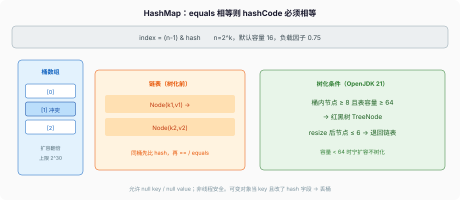

# 集合与泛型

`HashMap` 的 Javadoc 写得很干：基本 `get`/`put` 均摊常量时间，**前提是哈希把元素打散**。迭代时间和「容量 + 实际条目」成正比，所以初始容量开太大，迭代会变慢。负载因子默认 **0.75**。允许 `null` key、`null` value。非线程安全。

这些不是经验之谈，是类文档的承诺。`Hashtable` 不允许 null，方法带 `synchronized`，迭代 fail-fast。`ConcurrentHashMap` 不允许 null（null 被用来表示「现在没有」），迭代 **weakly consistent**。三种 Map 不能互相当「就是个 map」换着用。



---

## 一、接口怎么长

```
Iterable
  Collection          Map
    List                HashMap / LinkedHashMap / TreeMap / EnumMap
    Set                 ConcurrentHashMap
    Queue / Deque
```

`Collection` 是「一堆元素」；`Map` 不是 `Collection`。`keySet()`/`values()`/`entrySet()` 是视图，改视图就是改 map。`keySet().remove(k)` 等于 `map.remove(k)`。迭代 `entrySet` 时 `setValue` 改的是 map 里那条，不是副本。

### 1、List

有下标，允许重复。

`ArrayList` 是可变数组。OpenJDK 21：

- `DEFAULT_CAPACITY = 10`
- 无参构造把 `elementData` 指到共享的 `DEFAULTCAPACITY_EMPTY_ELEMENTDATA`（空数组）。**第一次 add** 才扩到 10。`new ArrayList<>(0)` 用的是另一份 `EMPTY_ELEMENTDATA`，第一次 add 按 `minCapacity` 长，不会直接跳到 10。两份空数组就是为了区分「默认容量还没inflate」和「用户就是要 0」。
- 再往后 `grow`：`ArraysSupport.newLength(old, minGrowth, old >> 1)`，也就是大约 **1.5 倍**，不是 HashMap 那种翻倍。
- 中间 `add(index, e)` 要 `System.arraycopy` 搬元素。随机读 O(1)，中间插 O(n)。

`LinkedList` 是双向链表，按下标访问是走链表，不是数组。随机读用 `ArrayList`。`LinkedList` 实现 `Deque`，当队列用可以，当 `List` 按下标切不要。

`List.of(...)`（9）不可变、不允许 null、不允许 `add`。`Arrays.asList` 是数组视图，`set` 可以，`add` 不行。两者经常被混。

### 2、Set

equals 意义下不重复。`HashSet` 是包着 `HashMap`，value 是一份共享的 `PRESENT` 哨兵。`LinkedHashSet` 保插入序。`TreeSet` 靠 `compareTo`/`Comparator`，不是 equals——两者不一致就会出现「Set 里两个 equals 为 true 的元素」这种违反 Set 契约的状态。

`EnumSet` 是位图，只装同一个 enum。比 HashSet 快、更省。

### 3、Queue / Deque

`ArrayDeque` 作栈/队列都比 `Stack`（继承 Vector）和 `LinkedList` 干净。环形数组，两头都能进。迭代无 ConcurrentModification 以外的惊喜，但仍然 fail-fast。

`PriorityQueue` 是堆，迭代无序，只保证堆顶最小（或比较器最小）。`poll` 才是按顺序出。`offer(null)` 抛 NPE。

不要用 `Vector`、`Hashtable`、`Stack` 写新代码。要同步，用 `Collections.synchronizedX` 或并发容器，不要靠 1.0 那套每个方法一把锁。`Collections.synchronizedList` 迭代仍要自己 `synchronized (list)` 包住，文档写了，漏了就不是线程安全。

---

## 二、HashMap 实际怎么放

### 1、常量，OpenJDK 21 源码原文

```java
static final int DEFAULT_INITIAL_CAPACITY = 1 << 4; // 16
static final int MAXIMUM_CAPACITY = 1 << 30;
static final float DEFAULT_LOAD_FACTOR = 0.75f;
static final int TREEIFY_THRESHOLD = 8;
static final int UNTREEIFY_THRESHOLD = 6;
static final int MIN_TREEIFY_CAPACITY = 64;
```

源码注释写明：`MIN_TREEIFY_CAPACITY` 至少是 `4 * TREEIFY_THRESHOLD`，避免扩容阈值和树化阈值打架。

### 2、hash 和下标

```java
static final int hash(Object key) {
    int h;
    return (key == null) ? 0 : (h = key.hashCode()) ^ (h >>> 16);
}
```

下标：`tab[(n - 1) & hash]`。`n` 保持 2 的幂，位与代替取模。高 16 位异或进低位，避免只低位变化时全撞一个桶。`null` key 的 hash 是 0，落在桶 0。

`hashCode` 差的 key（很多哈希只低位变）全挤一个桶，树化是后路，不是借口。自己写 key 的 `hashCode` 要把字段搅开，`Objects.hash` 可以，别只 return 一个低位变化的 id。

### 3、`putVal` 走一遍

第一次 put，`table` 是 null，先 `resize()` 分配容量 16 的数组，`threshold = 12`（16 * 0.75）。

桶空：直接 `newNode` 挂上。

桶不空：

1. 头结点 hash 相同且 (`==` 或 `equals`)，这就是要覆盖的那条。
2. 头结点是 `TreeNode`，走红黑树的 `putTreeVal`。
3. 否则沿链表走。走到空就尾插新节点；如果这次链上走过的节点数 `binCount >= TREEIFY_THRESHOLD - 1`（即加上新节点至少 8 个），调 `treeifyBin`。中途碰到 equals 相同的 key 就停，去覆盖。

覆盖：`onlyIfAbsent` 为 false（普通 put）时换 value，返回旧 value。`putIfAbsent` 走 `onlyIfAbsent=true`。

新插入：`++modCount`，`++size`，`size > threshold` 再 `resize()`。`modCount` 是 fail-fast 的版本号，结构修改才加，只改 value 不加。

### 4、`treeifyBin` 不一定树化

```java
final void treeifyBin(Node[] tab, int hash) {
    int n;
    if (tab == null || (n = tab.length) < MIN_TREEIFY_CAPACITY)
        resize();
    else {
        // 把这条桶的链表换成 TreeNode 再 treeify
    }
}
```

表还不到 64，**先扩容**。哈希均匀时扩容会把冲突拆开，根本不树化。树化是防哈希攻击 / 极坏哈希，不是「HashMap 变成 TreeMap」。

树节点仍保留 `next`，遍历可以当链表走。红黑树按 hash 排序，hash 相同再比 key 的 `Comparable`（如果实现了），再比身份。`HashMap` 的 key **不要求** `Comparable`；只有树化后同 hash 才用到。

resize 时树太矮（节点 ≤ `UNTREEIFY_THRESHOLD` = 6）退回链表。

### 5、`resize`：lo / hi 拆桶

容量翻倍。每个旧桶的节点，看 hash 的「新增那一位」：

- 那位是 0：还在原下标 `j`
- 那位是 1：去 `j + oldCap`

这就是源码里的 loHead / hiHead。O(n) 扫一遍，不必重新算 hash。1.7 头插在多线程扩容时能交出环；1.8 尾插不再成环，**仍会丢数据、仍会 size 错**。多线程用 `ConcurrentHashMap`，不要「我们量不大」赌 HashMap。

`new HashMap<>(100)` 不是容量 100。构造器把容量向上取到 2 的幂（128），threshold 再乘负载因子。要装 N 个元素还不扩容，初始容量至少 `N / 0.75`，再取 2 的幂。`new HashMap<>(expected, 0.75f)` 自己算。

### 6、LinkedHashMap、IdentityHashMap、WeakHashMap

`LinkedHashMap` 多一条双向链表，保插入序或访问序（`accessOrder=true` 时 get 也会把节点搬到链尾）。重写 `removeEldestEntry` 可当 LRU：`return size() > MAX;`。它继承 HashMap，非线程安全。

`IdentityHashMap` 用 `==` 和 `System.identityHashCode`，违反 Map 的 equals 契约，只给框架内部用（序列化、注解处理）。业务代码别用。

`WeakHashMap` 的 key 是弱引用，GC 后条目消失，适合「谁还握着这个 key 对象，条目就还在」的缓存。value 是强引用，value 如果反向引用 key，弱引用失效，条目永远清不掉——这是它最常见的坑。value 用 `WeakReference` 包一层，或干脆别用它当业务缓存。

---

## 三、ConcurrentHashMap 不是「加了锁的 HashMap」

### 1、文档承诺

和 `Hashtable` 一样 **不允许 null key/value**。`get` 读到的非 null 值，与当初的插入/更新有 happens-before。批量操作（`forEach`、`reduce`）反映的是这些单元素关系的组合，**不保证对整张表原子**。迭代器 weakly consistent：不抛 `ConcurrentModificationException`，可能看见也可能看不见并发插入，不会对你抛结构损坏。

Java 8 起不是 1.7 那种 Segment 分段锁。实现是桶数组 + 链表/红黑树，扩容时桶可以逐个转移，未转移的桶仍可读写。`sizeCtl` 控制初始化、扩容协助。面试还答「Segment 默认 16」是在答 1.7。

`size()` 在并发下是估计。计数用类似 `LongAdder` 的分段，不精确。要精确快照，没有无锁的免费午餐。`mappingCount()` 返回 long，避免 size 超过 `Integer.MAX_VALUE` 时截断。

### 2、复合操作

不要用 `chm.get(k); if (null) chm.put(k,v)`。用 `putIfAbsent` / `computeIfAbsent`。文档给的频率统计写法是：

```java
ConcurrentHashMap<String, LongAdder> freqs = new ConcurrentHashMap<>();
freqs.computeIfAbsent(key, k -> new LongAdder()).increment();
```

`compute*` 系列对这条 key 串行。计算函数里不要再进同一张 map，否则可能重入、`IllegalStateException`，文档写了 The remapping function must not modify this map during computation。

`computeIfAbsent` 的 mapping function 返回 null，表示不插入。CHM 不允许 null value，返回 null 就是「算了」。HashMap 的 `computeIfAbsent` 同样：返回 null 不插入。

`putIfAbsent` 返回旧值（没有则 null）。`replace(k, old, neu)` 按 `Objects.equals` 比旧值。record 当 value、状态机用 replace 做 CAS，实战篇会用。

---

## 四、泛型：擦除，不是 C++ 模板

### 1、运行时没有 `List<String>` 这个类

```java
List<String> a = new ArrayList<>();
List<Integer> b = new ArrayList<>();
System.out.println(a.getClass() == b.getClass()); // true，都是 ArrayList
```

类型参数被擦成边界（没写就是 `Object`，写了 `T extends Number` 就是 `Number`）。所以：

- 不能 `new T()`、不能 `new T[]`（数组要记运行时分量类型，擦掉就没了）
- 不能写 `List<int>`，只能 `List<Integer>`
- `instanceof List<String>` 非法，只能 `instanceof List<?>`
- 重载 `void f(List<String>)` 和 `void f(List<Integer>)` 擦完签名相同，编译失败
- 不能 `catch (T e)`，不能 `class Fail<T> extends Exception`

反射能拿到签名里的类型参数（`getGenericSuperclass`），那是 class 文件里的 Signature 属性，给编译器和工具看的，运行时检查不靠它。`ArrayList<String>` 的 `get(0)` 字节码是 `checkcast String`，这层 cast 是编译器插的。

### 2、不变、协变、逆变

`List<String>` **不是** `List<Object>` 的子类型（不变）。否则 `List<Object>` 引用指向 `List<String>`，`add(Integer)` 会在运行时把整型塞进只该装 String 的结构——数组协变已经犯过这错，泛型不跟。

要「只读」用 `List<? extends Number>`：能 `get` 成 `Number`，不能 `add`（除了 `null`）。要「只写」用 `List<? super Integer>`：能 `add(Integer)`，`get` 只能当 `Object`。这是 PECS：Producer Extends, Consumer Super。

```java
void copy(List<? extends Number> src, List<? super Number> dst) {
    for (Number n : src) dst.add(n);
}
```

`src` 是生产者，`dst` 是消费者。`List<?>` 等于 `List<? extends Object>`，几乎只能读成 `Object`、加 `null`。

### 3、桥方法、堆污染、`@SafeVarargs`

桥方法：`class Box implements Comparable<Box>` 的 `compareTo(Box)`，编译器再生成一个 `compareTo(Object)` 转调，满足擦除后的接口。你在反射里会看见两个方法，不是源码写了两份。

堆污染：`List` 原始类型（raw type）和参数化类型混用，运行时可能把 Integer 塞进「以为是 String」的 List，下次 `get` 的 `checkcast` 炸。

```java
List raw = new ArrayList<String>();
raw.add(1);                         // 警告，运行时塞进去了
List<String> typed = raw;
String s = typed.get(0);            // ClassCastException
```

不要用 raw type。新代码看见 `List` 不写 `<>` 就是事故。

`@SafeVarargs` 只抑制警告，不让 varargs 和泛型突然变成具体化。可变参数是数组，数组和泛型叠在一起仍会有堆污染。能不用就不用。方法必须 `static` 或 `final` 或 `private` 才能标这个注解——否则子类覆盖还能把堆污染扩大。

---

## 五、迭代与 fail-fast

`ArrayList` / `HashMap` 的迭代器：结构修改（不是通过迭代器自己的 `remove`）之后，`next` 可能抛 `ConcurrentModificationException`。实现是比较 `modCount` 和迭代器创建时的 `expectedModCount`。这是 **尽力检测**，不是契约保证每次都抛。单线程 for-each 里 `list.add` 必炸；多线程「没炸」不代表安全。

```java
for (String s : list) {
    if (s.isEmpty()) list.remove(s);    // CME
}
list.removeIf(String::isEmpty);         // 对
```

`for (E e : coll)` 是 iterator。`list.remove(e)` 在循环里改结构，走 fail-fast。要删，用 `iterator.remove()` 或 `removeIf`。按索引倒着删 `for (int i = list.size()-1; i >= 0; i--)` 不走迭代器，不会 CME，但可读性差，且只对 List 下标成立。

`CopyOnWriteArrayList` 迭代的是快照，不会 CME，写入拷贝整组，适合读多写极少。写多了分配会打爆。快照是写那一刻的数组，迭代开始之后的写入看不见——这是它的语义，不是 bug。

增强 for 不能拿来改 List 结构，下标 for 可以，但 ConcurrentModification 管不到你用下标时的并发。并发下标遍历 ArrayList 是 data race。

---

## 六、完整走一遍：一次 put 从 hash 到树化

假设 `HashMap<String, Integer> m = new HashMap<>();` 然后连续 put 8 个 **故意撞同一个桶** 的 key。普通 String 很难演示，用一个烂 hash 的 key：

```java
final class Bad {
    final String name;
    Bad(String name) { this.name = name; }
    public int hashCode() { return 1; }          // 全撞
    public boolean equals(Object o) {
        return o instanceof Bad b && name.equals(b.name);
    }
}

HashMap<Bad, Integer> m = new HashMap<>();
for (int i = 0; i < 20; i++) {
    m.put(new Bad("k" + i), i);
}
```

1. 第一次 put：`table` null，resize 到 16。hash 搅完仍进同一个桶（因为我们 hashCode 恒 1，搅完也恒）。
2. 第 2–7 次：链表变长，`binCount` 还没到 7，不树化。
3. 第 8 次：`binCount >= 7`，调 `treeifyBin`。表长 16 < 64，**resize 到 32**，不树化。节点按 lo/hi 拆——但我们 hash 恒 1，拆完仍可能挤在一起。
4. 继续 put，表长到 64 之前每次「该树化」都改成扩容。
5. 表长 ≥ 64 且单桶 ≥ 8：真正 `treeify`，这条桶变成红黑树。
6. `get` 先比 hash，再 `==` / `equals`。树上看 hash，同 hash 再 Comparable / 身份。

面试答「超过 8 就树化」少了「表还不到 64 先扩容」这半句，是错的。源码 `treeifyBin` 第一行就是这个 if。

---

## 七、CHM 的 `sizeCtl`、ArrayList 怎么长、`modCount` 为什么「尽力」

### 1、CHM 扩容不是整表一把锁

Java 8 起没有 Segment。`sizeCtl` 是一个 int，负值表示正在初始化或扩容（高位记「多少 worker 在协助」一类编码），正值是下次扩容阈值。扩容时旧表的桶可以逐个转移到新表：某个线程 `put` 撞上转发节点，会帮着搬几个桶再干自己的活。面试答「分段锁 16」是 1.7。

`size()` 走类似 LongAdder 的计数，并发下是估计。`mappingCount()` 返回 long。精确快照没有无锁免费午餐。

### 2、`ArrayList.grow`

无参构造：`elementData` 指向共享空数组 `DEFAULTCAPACITY_EMPTY_ELEMENTDATA`。第一次 `add`，`oldCapacity==0` 且是这份空数组，直接 `new Object[Math.max(10, minCapacity)]`。`new ArrayList<>(0)` 用另一份 `EMPTY_ELEMENTDATA`，第一次按 `minCapacity` 长，不跳到 10。

之后：`ArraysSupport.newLength(old, minGrowth, old >> 1)`，优先涨约 50%。不是 HashMap 翻倍。中间 `add(i, e)` 要 `arraycopy`，随机插是 O(n)。`ensureCapacity` 在默认空表且 `minCapacity <= 10` 时故意不 inflate——避免 `ensureCapacity(8)` 把默认表扩到 8 而不是 10。

### 3、`modCount` 是尽力，不是契约

结构修改（add/remove 导致容量或 size 变，HashMap 的 put 新 key）`++modCount`。只改 HashMap 的 value 不加。迭代器创建时记下 `expectedModCount`，`next` 发现不一致就 CME。

规范 / Javadoc：**best-effort**。单线程 for-each 里 `list.add` 必炸。多线程一个在遍历一个在 add，可能 CME，可能把数组读成错的而不抛——检测靠的是一个不加锁的 int，不是 happens-before。没抛 CME 不等于线程安全。`subList` 的 fail-fast 看的是父 list 的 modCount，父结构变了子视图也炸。

---

## 八、反模式

- 多线程共享 `HashMap`。
- `hashCode` 用可变字段，对象已在 set 里还改。
- `TreeSet` 的 `compareTo` 和 `equals` 打架。
- `List<Object>` 当万能容器，然后一路强转。
- `new ArrayList<>(100000)` 只为了装 3 个元素，还经常 `iterator`。
- 用 `Hashtable` 当线程安全 Map。要并发用 `ConcurrentHashMap`。
- `chm.get` 然后 `put` 当「没有才插入」。
- `List.of` 和 `Arrays.asList` 当可变 List。
- raw type。
- `hashCode` 恒 0「反正会树化」。树化是 O(log n)，不是 O(1)，还先让你扩容好几轮。

下一篇把 checked 异常、try-with-resources、NIO.2、ByteBuffer 钉完。容器会抛的那些异常，规则在异常篇，不在这里编。
