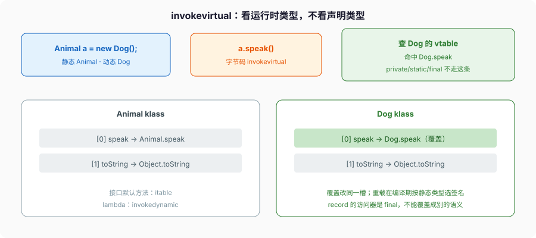

# 面向对象

```java
Animal a = new Dog();
a.speak();
```

编译器看见的类型是 `Animal`，字节码仍是 `invokevirtual speak`。运行时顺着 `Dog` 的 klass 找 vtable 槽，调到的是 `Dog.speak`，不是 `Animal.speak`。这叫覆盖，看动态类型。

```java
void f(Animal a) {}
void f(Dog d) {}
f(a);   // 编译期按 a 的静态类型选 f(Animal)
```

这叫重载，看静态类型。两套机制经常被混成一句「多态」。混了之后，面试里 `equals(Object)` 和 `equals(Dog)` 就会写成两个方法，后者不是覆盖，调用方拿 `Object` 引用永远进不去。



C++ 默认静态绑定，要虚才动态；Go 的接口是 itable，具体类型方法集在编译期算好；Python 运行时在 MRO 上找。Java 实例方法默认虚（`private` / `static` / `final` / 构造器除外）。HotSpot 会给单态调用做内联缓存，调用点只见过一种接收者就把虚调用变成直接调用；来了第二种接收者再升级。这是实现，语言规则仍是「实例方法默认虚」。

---

## 一、对象怎么造出来

### 1、`new Dog(1)` 的步骤

JVMS 对象创建 + JLS §12.5：

1. 按类加载规则把 `Dog` 加载、链接、初始化完（超类先初始化）。
2. 堆上分配，实例字段填默认值（§4.12.5）。
3. 调构造器。构造器第一件事必须是 `this(...)` 或 `super(...)`（或编译器插入的 `super()`）。
4. 超类构造器返回后，跑本类的实例初始化器（`{}` 块）和字段实例初始化表达式，源码顺序。
5. 跑构造器剩下的语句。

```java
class Parent {
    int p = init("p-field");
    Parent() {
        System.out.println("Parent ctor, p=" + p);
        hook();                     // 虚调用，子类字段还没赋
    }
    void hook() {}
    static int init(String tag) {
        System.out.println("init " + tag);
        return 1;
    }
}

class Child extends Parent {
    int c = init("c-field");
    Child() {
        System.out.println("Child ctor, c=" + c);
    }
    @Override void hook() {
        System.out.println("hook c=" + c);  // 这里 c 还是 0
    }
}
```

输出顺序：

```text
init p-field
Parent ctor, p=1
hook c=0          ← 子类字段还没走到第 4 步
init c-field
Child ctor, c=1
```

实例初始化器里不能 `return`（§8.6）。`this` 在超类构造器返回前，不能读本类实例字段、不能调本类实例方法——对象还没走到第 4 步。构造器里调可覆盖方法，子类看到的是默认值。这是 this-escape 的近亲，并发篇的 final freeze 也从这儿裂出去。

### 2、默认构造器、重载构造器、`this(...)`

没有写构造器，编译器给一个无参默认构造器，访问级别和类相同。一旦你写了任意构造器，默认的就没了。这是 `new Foo()` 突然编译失败的常见原因。

`this(...)` 必须是构造器第一句。不能 `this` 和 `super` 都写。循环 `this` 编译失败。多个构造器把公共校验抽到一个私有构造器，再用 `this(...)` 转，避免复制。

`static` 字段在类初始化时赋一次（§12.4.2）。`static final` 的常量变量（编译期常量）更早，用简单名引用时看不到默认值。静态初始化器按源码顺序，互相引用能看见「前面已经赋了、后面还是默认值」：

```java
class Order {
    static int a = 1;
    static int b = a + 1;       // 2
    static int c = d + 1;       // d 还是 0，c=1
    static int d = 3;
}
```

别靠这个顺序写业务。环依赖让 `<clinit>` 看见默认值，类加载篇的初始化锁会把同一线程的递归当成「已初始化」。

### 3、record

`record Point(int x, int y) {}` 是 final 类，自动生成：

- 分量字段（private final）
- 访问器 `x()` / `y()`（不是 `getX`）
- 规范构造器
- `equals` / `hashCode` / `toString`（按分量）

可以写 compact constructor 做校验：

```java
record Point(int x, int y) {
    Point {
        if (x < 0 || y < 0) throw new IllegalArgumentException();
        // 不能把 x 改成可变字段还指望 equals 稳定
    }
}
```

record 可以有静态成员、可以再写实例方法，不能继承别的类（隐式继承 `java.lang.Record`），可以实现接口。分量不能再声明成非 final。嵌套 record 默认 static。

`equals` 按分量比，数组分量用的是引用身份，不是 `Arrays.equals`。record 里塞 `int[]`，两个内容相同的数组不相等。要值相等，自己覆盖，或把数组换成 `List`。

### 4、enum

`enum Color { RED, GREEN }` 是类，实例在类初始化时创建，个数钉死。构造器只能 private。`==` 对 enum 安全，因为没有别的实例。不要自己 `new` 出 enum（做不到）。

```java
enum Status {
    PENDING(0), RUNNING(1), DONE(2);
    private final int code;
    Status(int code) { this.code = code; }
    int code() { return code; }
}
```

`switch` 对 enum 在 21 之前不穷尽也不报错（缺 case 走 default 或什么都不做）；21 的模式匹配 switch 可以对 sealed / 非传统选择器要求穷尽，enum 作为老选择器类型，语句形式仍可以不穷尽。当穷尽用的时候写成表达式，漏了编译器打你。

`EnumSet` / `EnumMap` 按 ordinal 做位图或数组，比 Hash 快。不要用 `ordinal()` 当持久化值——插入新常量会让旧数据错位。持久化用自己的 `code` 字段。

`valueOf(String)` 严格匹配常量名，匹配不到抛 `IllegalArgumentException`。用户输入不要直接 `valueOf`。

---

## 二、覆盖 vs 重载 vs 隐藏

### 1、覆盖（override）

子类实例方法与超类实例方法 **签名相同**（方法名 + 参数类型，擦除后），返回类型协变合法，访问不能更严，checked 异常不能更多。运行时走 `invokevirtual` / `invokeinterface`。`@Override` 写上。写错签名编译器立刻打你，这就是它存在的理由。

返回类型协变：

```java
class Animal {
    Animal copy() { return this; }
}
class Dog extends Animal {
    @Override Dog copy() { return this; }   // 合法，比 Animal 更窄
}
```

桥方法：擦除后 `copy()` 的返回值都是 `Animal`，编译器再生成一个 `copy()` 返回 `Animal`、内部转调 `Dog.copy()`。反射里会看见两个方法。

### 2、重载（overload）

同一类里方法名同、参数类型不同。编译期按 **静态类型** 选最具体的那个。运行时不再选。

```java
class Dog extends Animal {
    @Override void speak() { }          // 覆盖
    void speak(int times) { }           // 重载，和 Animal.speak() 无关
    void equals(Dog o) { }              // 不是覆盖 Object.equals(Object)
}
```

`Object.equals` 的签名是 `equals(Object)`。写成 `equals(Dog)` 只是重载。`HashMap` 调的是 `equals(Object)`，你的 `equals(Dog)` 永远不会被容器用到。这是实打实的生产 bug。

重载选择在变参、装箱、继承同时出现时会变复杂。`f(Object)`、`f(String)`、`f(Integer)`，`f(null)` 选 `f(String)` 和 `f(Integer)` 都更具体，编译失败（ambiguous）。变参是最后一档：能匹配固定参数就不会走变参。不要靠「我记得优先级」写重载，写完用调用点的静态类型走一遍。

### 3、隐藏（hide）

`static` 方法、字段，按静态类型解析。`Child.staticM()` 和 `Parent.staticM()` 是两个方法。用父类引用调静态方法，调的是父类那个——和实例覆盖完全不是一回事。不要把 static 当虚方法用。

```java
class Parent {
    static String tag() { return "P"; }
    String name() { return "p"; }
}
class Child extends Parent {
    static String tag() { return "C"; }
    @Override String name() { return "c"; }
}

Parent p = new Child();
System.out.println(p.tag());    // "P"，静态绑定
System.out.println(p.name());   // "c"，动态绑定
```

`private` 方法不参与覆盖。子类写同签名，只是另一个方法。父类方法里 `this.privateM()` 永远是父类那个。

`final` 方法不能覆盖。`final` 类不能继承。`record` 已经是 final。`static final` 字段是常量，子类再声明同名是隐藏，不是覆盖。

---

## 三、接口：默认方法、私有方法、密封

### 1、接口里能放什么

接口里可以有：抽象方法、`default` 方法（有方法体）、`static` 方法、`private` 方法（9 起，给 default 复用）、常量（`public static final`）。不能有实例字段。不能有构造器。

类实现多个接口，两个 default 方法签名冲突，类必须自己覆盖，否则编译失败。类自己的实例方法优先于接口 default。

```java
interface A { default void f() { } }
interface B { default void f() { } }
class C implements A, B {
    @Override public void f() { A.super.f(); }  // 必须选边或重写
}
```

这不是菱形继承的数据副本问题（接口没有实例字段）。冲突的是行为。C++ 虚继承解决的是子对象份数；Java 接口本来就没有子对象。

接口的 `static` 方法不继承，必须 `A.staticM()` 去调。8 之前接口常量被滥用成「常量接口」，别再写。

### 2、函数式接口和 lambda

函数式接口：恰好一个抽象方法（`default`/`static` 不算）。`@FunctionalInterface` 约束这一点。lambda 和 方法引用的目标类型必须是函数式接口。`Runnable`、`Comparator`、`Function` 都是。

```java
Comparator<String> byLen = (a, b) -> Integer.compare(a.length(), b.length());
Comparator<String> byLen2 = Comparator.comparingInt(String::length);
```

lambda 捕获的局部变量必须是 effectively final。改了再捕获，编译失败。捕获的是变量的值（对引用是那份引用），不是名字。循环里 `for (int i = 0; i < n; i++) { run(() -> use(i)); }` 非法，因为 `i` 在变；`final int idx = i;` 再捕获 `idx` 合法。

lambda 不是匿名内部类。`this` 在 lambda 里是外围实例，不是「lambda 对象」。匿名内部类的 `this` 是匿名类自己。lambda 不生成 `Foo$1.class` 那种类文件（invokedynamic + LambdaMetafactory），匿名内部类会。

### 3、sealed

`sealed interface Shape permits Circle, Rect {}`（17 起正式）把实现者名单钉死。`permits` 里的类型必须和接口在同一模块（未命名模块则同一包）。许可类型必须 `final`、`sealed` 或 `non-sealed`。模式匹配 `switch` 才能在编译期穷尽。

`non-sealed` 等于在名单上开一个口，允许名单外再继承。开了就回到普通继承，穷尽性没了。能 final 就 final。

---

## 四、`equals` 和 `hashCode` 是同一份契约

### 1、规范原文在 Javadoc，不是口口相传

`Object.equals`：

- 自反：`x.equals(x)` 为 true（`x` 非 null）
- 对称：`x.equals(y)` 当且仅当 `y.equals(x)`
- 传递
- 多次调用，信息没变则结果不变
- `x.equals(null)` 为 false

`hashCode`：同一执行期内，equals 所用信息没变，hashCode 必须稳定；**equals 为 true 则 hashCode 必须相等**；equals 为 false 时 hashCode 可以碰撞。

违反第二条：`HashMap` / `HashSet` 丢数据。`a.equals(b)` 但 hash 不同，放进桶 A，用 b 去取走桶 B。

`==` 是身份（同一个对象）。默认 `equals` 就是 `==`。值对象必须覆盖两者，或改成 `record`（编译器生成的 `equals` 按分量比）。

### 2、对称性最容易在「子类加字段」上碎

```java
class Point {
    final int x, y;
    public boolean equals(Object o) {
        return o instanceof Point p && p.x == x && p.y == y;
    }
    public int hashCode() { return Objects.hash(x, y); }
}
class ColoredPoint extends Point {
    final Color c;
    public boolean equals(Object o) {
        return o instanceof ColoredPoint cp && super.equals(cp) && cp.c == c;
    }
}
```

`Point.equals(ColoredPoint)` 可能 true（只比 x,y），反过来 false。HashSet 里两个对象一个找得到一个找不到。Effective Java 的结论可以直接用：**值类型不要为了加字段去继承**，用组合，或 sealed + record。

`instanceof` 模式（16）比 `getClass() == o.getClass()` 宽松：子类实例能被父类 equals 认。`getClass()` 严格，子类永远不等于父类，对称性保住了，但 `equals` 对继承不友好。两条路都有代价，所以值类型别继承。

### 3、可变字段、`compareTo`

`hashCode` 必须用 equals 用到的字段。Lombok / record 生成没问题；手写漏字段是常规事故。可变字段参与 equals：对象放进 HashMap 后你改了字段，hash 变了，原桶找不到它，也删不掉。`String` 能当 key 正因为不可变。

```java
class Key {
    int x;
    public boolean equals(Object o) { return o instanceof Key k && k.x == x; }
    public int hashCode() { return x; }
}

Key k = new Key();
k.x = 1;
Set<Key> set = new HashSet<>();
set.add(k);
k.x = 2;
System.out.println(set.contains(k));    // false
System.out.println(set.contains(new Key() {{ x = 1; }})); // 也找不到
// set 里有一个幽灵，size 仍是 1，删不掉
```

`compareTo` 和 `equals` 不一致时，`TreeMap` 按比较排序，`HashMap` 按 equals。同一个 `Set` 语义在两种 Map 里分裂。`Comparable` 的规范要求：`compareTo` 返回 0 当且仅当 equals 为 true。做不到就不要实现 `Comparable`，交给外部 `Comparator`。

`hashCode` 实现：`Objects.hash(a, b, c)` 方便，每次装箱。手写 `31 * result + field` 少分配。不要用 `Random` 当 hash，不要把身份哈希和值哈希混用。`System.identityHashCode` 跟默认 `Object.hashCode` 同类，跟你覆盖的 `hashCode` 无关。

---

## 五、访问级别、嵌套类、this

### 1、四级访问

`private`：本类（含嵌套类）。
默认（包可见）：同包。
`protected`：同包 + 子类（子类在别的包只能通过子类实例访问 protected 成员，不能通过超类引用乱访）。
`public`：模块导出的前提下到处可见。模块没导出，别的模块仍然碰不到——这是 9 之后多出来的一层，细节在类加载篇。

嵌套类能访问外部类的 private，外部类也能访问嵌套类的 private。这是同一顶层类的内部，编译器会生成 `access$000` 这类桥。

### 2、静态嵌套 vs 内部类

`static` 嵌套类没有外部实例指针；内部类（非 static）隐式持有外部 `this`，序列化、内存泄漏都从这儿来。能 static 就 static。

```java
class Outer {
    class Inner {}
    static class Nested {}
}

Outer o = new Outer();
Outer.Inner i = o.new Inner();     // 必须有外部实例
Outer.Nested n = new Outer.Nested();
```

匿名内部类是内部类，持有外部 this。lambda 不持有「自己」，只捕获用到的那份引用。Swing / Android 里 `new OnClickListener() { ... }` 把 Activity 抓住，是泄漏经典现场。

局部类、匿名类访问的局部变量必须 effectively final，和 lambda 同一条。

---

## 六、完整走一遍：equals 写错的三种现场

```java
final class UserId {
    private final String value;
    UserId(String value) { this.value = Objects.requireNonNull(value); }

    @Override public boolean equals(Object o) {
        return o instanceof UserId u && value.equals(u.value);
    }
    @Override public int hashCode() { return value.hashCode(); }
    @Override public String toString() { return value; }
}
```

这是对的：final 类、字段不可变、equals/hashCode 对称、`null` 进不来。

三种写错：

1. **只写 `equals(UserId)`。** HashMap 调 `equals(Object)`，永远走 `Object.equals` 身份比较。两个 `new UserId("a")` 当两个 key。
2. **覆盖 equals 不覆盖 hashCode。** 默认 hashCode 是身份。两个值相等的 UserId 进不同桶。
3. **value 改成可变的 `StringBuilder`，put 之后还 append。** 丢桶。

`record UserId(String value) {}` 直接避开这三条。能 record 就 record。

---

## 七、字节码分派、桥方法、序列化

### 1、四条 invoke，不是都叫「虚调用」

- `invokevirtual`：实例方法，看接收者的运行时类型。覆盖走这条。
- `invokeinterface`：接口方法，itable。默认方法也从这儿进，再决定是类覆盖还是接口体。
- `invokespecial`：构造器、`super.method`、private 实例方法。静态绑定，不看子类覆盖。
- `invokestatic`：静态方法。隐藏不是覆盖。
- `invokedynamic`：调用点在链接期由引导方法决定目标。lambda、`StringConcatFactory`、部分 switch。不是「动态语言才用」。

`private` 方法 11 起对 nestmate 仍是 `invokespecial`，不进 vtable。子类写同签名只是另一个方法。`final` 实例方法仍是 `invokevirtual`，JIT 可以当成单态直接调，语言上不能覆盖。

### 2、桥方法在 javap 里长什么样

```java
class Box implements Comparable<Box> {
    public int compareTo(Box o) { return 0; }
}
```

`javap -c Box` 两个 `compareTo`：

```text
public int compareTo(Box);
  descriptor: (LBox;)I
  Code:  iconst_0  ireturn          // 你写的

public int compareTo(java.lang.Object);
  descriptor: (Ljava/lang/Object;)I
  Code:
    aload_0
    aload_1
    checkcast     Box
    invokevirtual compareTo:(LBox;)I
    ireturn                         // 合成桥
```

| 谁调 | 链到 |
| --- | --- |
| `box.compareTo(otherBox)` 静态类型 Box | 你写的 `(LBox;)I` |
| `Comparable.compareTo(Object)` / TreeMap | 桥 `(Ljava/lang/Object;)I` → checkcast → 你写的 |

`getDeclaredMethods` 两个都在。`isBridge()` 为 true 的那个不是源码。漏看桥，数目对不上。协变返回同样：`Dog copy()` 覆盖 `Animal copy()`，桥返回 `Animal`、转调 `Dog.copy`。

### 3、序列化和 record

`Serializable` 是标记接口。字段进字节流，`transient` 不进。没有显式 `serialVersionUID` 时，计算依赖类结构——加一个字段，老数据 `InvalidClassException`。值对象要序列化，**自己写死 UID**。

`readObject` / `writeObject` 是私有约定方法，不是接口，签名必须精确。`record` 的序列化按分量走规范构造器，compact constructor 的校验在反序列化时也会跑——这是 16 之后的合同，比普通类「反射填字段绕过构造器」干净。不要给 record 再手写 `readObject` 除非你知道自己在破坏这条。

`ObjectInputStream` 能造对象而不走公开构造器（普通类）。单例靠「构造器 private」挡不住反序列化再来一份，要用 `readResolve` 或枚举。枚举序列化按名字，不是字段。

---

## 八、反模式

- 覆盖 `equals` 不覆盖 `hashCode`。
- `equals(Dog)` 当覆盖。
- 可变对象当 HashMap key 还改字段。
- 为加字段继承值类型，搞碎对称性。
- 用静态方法模拟虚方法。
- 内部类能 static 却不写，抓住外部 this。
- 接口里堆状态——做不到，硬用 default 方法去改实现类字段，是把接口当抽象类用。
- 构造器里调可覆盖方法。
- `enum.ordinal()` 当数据库列。
- lambda 里改「看起来没变」的数组元素当副作用，再把这个 lambda 丢进并行流。

下一篇把 `Collection`/`Map`、擦除、`HashMap` 树化阈值按 OpenJDK 21 源码钉死。对象相等规则已经在这里，容器只是它的用户。
