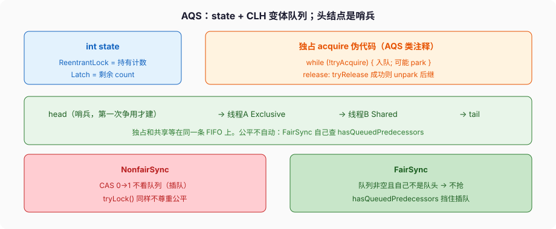
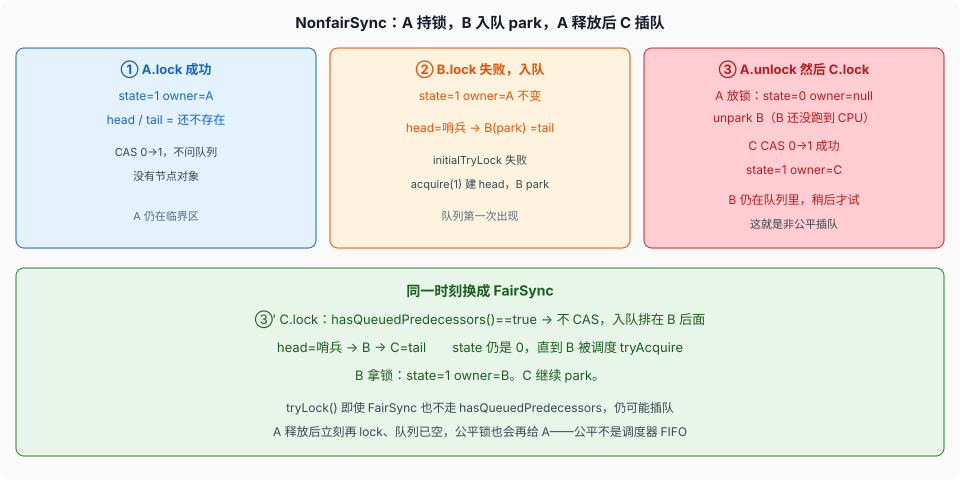

# AQS 与同步器

`ReentrantLock.lock()` 失败之后，线程不是在 Java 里空转，是进 `AbstractQueuedSynchronizer` 的队列，`LockSupport.park` 睡下去。`CountDownLatch.await`、`Semaphore.acquire`、`ReentrantReadWriteLock.readLock` 走同一套架子，差的只是 `state` 的含义和 `tryAcquire` 怎么写。

并发篇已经把 happens-before 和「Lock 的 lock/unlock 等于 monitor 的 Lock/Unlock」钉过。这篇对着 OpenJDK 21 的 AQS 类注释和 `ReentrantLock.Sync`，把队列、公平、Condition 搬队列三件事走完。自己再写一个同步器，优先组合 Latch / Semaphore；真要写，扩 AQS，不要从 `wait/notify` 搭。



---

## 一、两块零件：`state` 和一条 FIFO

AQS 类注释把独占获取写成：

```text
Acquire:
    while (!tryAcquire(arg)) {
        enqueue thread if it is not already queued;
        possibly block current thread;
    }

Release:
    if (tryRelease(arg))
        unblock the first queued thread;
```

共享模式类似，成功时可能把后继也叫醒（cascading signals）。

**`state`。** 一个 `int`，CAS 改。子类解释它：

- `ReentrantLock`：持有计数。0 没人持有；同一线程再 `lock` 就 `state+1`，超过 `Integer.MAX_VALUE` 抛 `Error("Maximum lock count exceeded")`。
- `CountDownLatch`：剩余 count。`tryAcquireShared` 在 `state == 0` 时成功。
- `Semaphore`：剩余许可。共享获取，一次可以减多个。
- `ReentrantReadWriteLock`：高 16 位读计数，低 16 位写计数（实现细节，面试说到「一个 int 拆两半」即可，别把位移常数背成规范）。

AQS **不理解** 独占和共享的业务差别，只机械地：独占成功则别人不能成功；共享成功则后继若也是共享，要再问一次能不能拿。两种模式的等待者排在 **同一条 FIFO** 上。

**队列。** 注释写明基于内部 FIFO，但 **不自动执行 FIFO 获取策略**。公平要子类自己做。CLH 队列需要一个 dummy 头；AQS **构造时不建**，第一次争用才把 `head`/`tail` 立起来。没争用的锁，就是一个 `state`，没有节点对象。

节点里记：等待的线程、独占还是共享、后继。取消的节点从链上摘。`unparkSuccessor` 叫醒头后面第一个有效后继。

---

## 二、独占：`ReentrantLock` 的 `state` 就是重入次数

### 1、非公平：先 CAS，不问队列

OpenJDK 21 `ReentrantLock.NonfairSync`：

```java
final boolean initialTryLock() {
    Thread current = Thread.currentThread();
    if (compareAndSetState(0, 1)) {          // 第一下不管队列
        setExclusiveOwnerThread(current);
        return true;
    } else if (getExclusiveOwnerThread() == current) {
        int c = getState() + 1;
        if (c < 0)
            throw new Error("Maximum lock count exceeded");
        setState(c);                         // 重入，持有者改 state 不必 CAS
        return true;
    } else
        return false;
}

protected final boolean tryAcquire(int acquires) {
    if (getState() == 0 && compareAndSetState(0, acquires)) {
        setExclusiveOwnerThread(Thread.currentThread());
        return true;
    }
    return false;
}
```

`lock()` 先 `initialTryLock()`，失败再 `acquire(1)` 进 AQS 队列。非公平的意思：队列里已经有人 park 了，新来的线程仍可以在 `state==0` 的窗口 CAS 插队。吞吐通常更好，有人可能饿。

`tryLock()` **永远不尊重公平**。文档写了，想尊重公平用 `tryLock(0, SECONDS)`。

### 2、公平：队列里有人且自己不是队头，不抢

`FairSync.initialTryLock`：`state==0` 时先 `!hasQueuedThreads()` 才 CAS。`tryAcquire` 用 `!hasQueuedPredecessors()`：同步队列里存在排在自己前面的有效节点，就返回 false，老老实实入队。

`hasQueuedPredecessors` 挡的是 **插队的新线程**，不是「调度器必须按 FIFO 跑」。文档原话：公平不保证线程调度公平，一个线程仍可能连续拿到锁——释放之后它立刻再 `lock`，若队列空，公平锁也会给它。

### 3、释放

```java
protected final boolean tryRelease(int releases) {
    int c = getState() - releases;
    if (getExclusiveOwnerThread() != Thread.currentThread())
        throw new IllegalMonitorStateException();
    boolean free = (c == 0);
    if (free)
        setExclusiveOwnerThread(null);
    setState(c);
    return free;                             // 减到 0 才真的释放
}
```

重入三次必须 `unlock` 三次。`free==true` 时 AQS `release` 才 `signalNext(head)`，把后继 unpark。持有者自己 `unlock` 多一次，`IllegalMonitorStateException`。漏 `unlock`，队列里的人永远醒不来。这就是必须 `try/finally` 的原因——语言不像 `synchronized` 那样在字节码异常路径上插 `monitorexit`。

`setExclusiveOwnerThread` 来自 `AbstractOwnableSynchronizer`。jstack / JFR 能显示「这把锁被谁持有」，自己写同步器也该用它。

---

## 三、共享：Latch 的 `state` 是剩余票

`CountDownLatch` 初始化 `state = count`。`countDown` 把 state CAS 减一，减到 0 调用 `releaseShared`，把队列里所有等着的共享获取都放行。之后 `await` 立刻返回——一次性，不能 reset。要循环栅栏用 `CyclicBarrier` 或 `Phaser`。

文档的 happens-before：count 到 0 之前，`countDown()` 之前的动作 hb 另线程成功返回 `await()` 之后的动作。这是 JMM 边，不是「大概能看见」。

`Semaphore` 的 state 是许可数。`acquire(k)` 一次要 k 个，许可不够就入队。公平信号量同样靠 `hasQueuedPredecessors` 一类检查，非公平允许插队。`drainPermits` 把剩余许可一次抽走，不公平场景下别当精确计数。

共享获取成功后 AQS 会让后继也 `tryAcquireShared`：读锁可以叠很多人，一个人放行不够。独占释放只叫醒一个。混在同一条 FIFO 上时，写锁后面跟着一串读锁，写锁释放会把读锁连锁放行——`ReadWriteLock` 靠这个。读锁持有时写锁进不去，写锁持有时读锁进不去。读锁不可升级成写锁（同一线程先读后写，死锁）。降级可以：持有写锁再拿读锁，再放写锁。

---

## 四、Condition：另一条链表，signal 时搬回去

`synchronized` 的 wait set 只有对象上那一份。`ReentrantLock.newCondition()` 可以多把。`ConditionObject` 自己维护 `firstWaiter / lastWaiter`，和 AQS 同步队列不是同一条链。

`await` 的步骤（实现语义，不是要背方法名）：

1. 必须已经持有独占锁，否则 `IllegalMonitorStateException`（和 `wait` 必须持有 monitor 同一类约束）。
2. 把当前线程包装成条件节点，挂到条件队列。
3. **完全释放** 锁（重入计数清到 0，否则别人进不来）。
4. `park`，直到被 `signal` / `signalAll`、中断、或超时。
5. 被 signal 的节点 **转移到同步队列**，重新走 `acquire` 抢锁。
6. 抢到锁之后 `await` 返回，此时已经再次持有锁，重入计数恢复。

`signal` 只搬一个；`signalAll` 搬全部。搬完还不等于拿到锁——只是有资格去同步队列里排。所以业务条件仍要 `while (!ready)`，虚假唤醒和「搬过去时条件又变了」都存在。

条件队列上的节点取消（中断、超时）要能从条件链上摘掉，否则 signal 可能叫醒一个已经不感兴趣的人。OpenJDK 实现里有清理逻辑，自己写 Condition 很容易在这里漏。

---

## 五、park 与中断

AQS 阻塞用 `LockSupport.park`，不是 `Object.wait`。`unpark` 可以先于 `park` 调用，许可积一张，下一次 `park` 立刻返回。这是「signal 之后再 await」仍能对上的底层原因之一——但 Condition 仍要求先持锁，不要靠 unpark 许可当协议。

`lockInterruptibly` / `acquireInterruptibly`：park 期间响应中断，抛 `InterruptedException`，节点取消。`lock()` 不响应中断，中断标记会在获取成功之后仍然留下（实现会在返回前 `selfInterrupt`）。两种语义选错，取消链路就断。

虚拟线程上 `park` 会卸载 carrier。`synchronized` + `wait` 在 Java 21 钉住；`ReentrantLock` + `Condition.await` 走 park，能卸。热路径长时间等条件，用 Condition 不是为了时髦，是为了 21 的卸载。

---

## 六、会错的程序：三线程，A 释放的窗口给 C 插队

下面不是「可能插队」四个字，是一张表。调度器只要在 A.unlock 返回之后、B 从 park 跑到 `tryAcquire` 之前，插入 C.lock，NonfairSync 就会走出第三列。

```java
ReentrantLock lock = new ReentrantLock(); // NonfairSync
// 线程 A
lock.lock();
// ……临界区……
lock.unlock();

// 线程 B 在 A 持锁期间
lock.lock();   // 入队，park

// 线程 C 在 A.unlock 之后立刻
lock.lock();   // 非公平：CAS 0→1，B 还在队列里
```



### 逐步表（NonfairSync）

| 时刻 | 刚执行完 | state | owner | 队列 | B / C |
| --- | --- | --- | --- | --- | --- |
| ① | A.lock，`CAS(0,1)` 成功 | 1 | A | 无（head 还不存在） | — |
| ② | B.lock，`initialTryLock` 失败，`acquire(1)` 建哨兵，B 节点入队，park | 1 | A | head=哨兵 → B=tail | B park |
| ③a | A.unlock，`tryRelease`：state=0，owner=null，`signalNext` unpark B | 0 | null | 仍是 哨兵 → B | B 被 unpark，**还没跑到 tryAcquire** |
| ③b | C.lock，`initialTryLock`：`CAS(0,1)` **成功**，不问队列 | 1 | **C** | 仍是 哨兵 → B | C 持锁；B 稍后 tryAcquire 失败再 park |

合上源码看下一行：③b 的 `compareAndSetState(0, 1)` 不读 `hasQueuedPredecessors`。队列里有人不是「不能 CAS」的条件。这就是非公平。

### 改一行：`new ReentrantLock(true)`

同一时刻换成 `FairSync`。③b 变成：

| 时刻 | 刚执行完 | state | owner | 队列 |
| --- | --- | --- | --- | --- |
| ③b′ | C.lock：`hasQueuedPredecessors()==true`，**不 CAS**，入队排在 B 后 | 0 | null | 哨兵 → B → C |
| ④ | B 被调度，`tryAcquire` 成功 | 1 | **B** | 哨兵（B 变 head）→ C park |

表必须变成 B 先拿。C 即使在 A 释放的窗口到达，公平锁也不给它。

再改一行：C 改成 `tryLock()`，即便构造器是 `true`，`tryLock` 仍不走 `hasQueuedPredecessors`，③b 又变回 C 持锁。文档写了：untimed `tryLock()` 不尊重公平。

---

## 七、反模式

- 公平锁当「一定按排队顺序跑」，拿它补调度器的公平。吞吐掉一截，饥饿仍可能。
- `tryLock()` 当公平锁的非阻塞入口。它不尊重公平。
- 重入三次 `unlock` 一次，后续获取者永远等。
- `lock()` 之后不用 `finally`。
- 条件 `if (!ready) await()`，不用 `while`。
- 读锁升级写锁。同一线程先 `readLock` 再 `writeLock`，死锁。
- 自己用 `wait/notify` 仿 AQS。许可、取消、中断、搬队列，漏一项就是生产事故。
- 虚拟线程热路径上用 `synchronized wait` 等条件，Java 21 钉 carrier。

下一篇把 `CompletableFuture` 的依赖边和默认 `commonPool` 钉完。AQS 管的是「同一把锁上谁睡」；CF 管的是「任务之间谁等谁」，默认还抢 ForkJoinPool。
