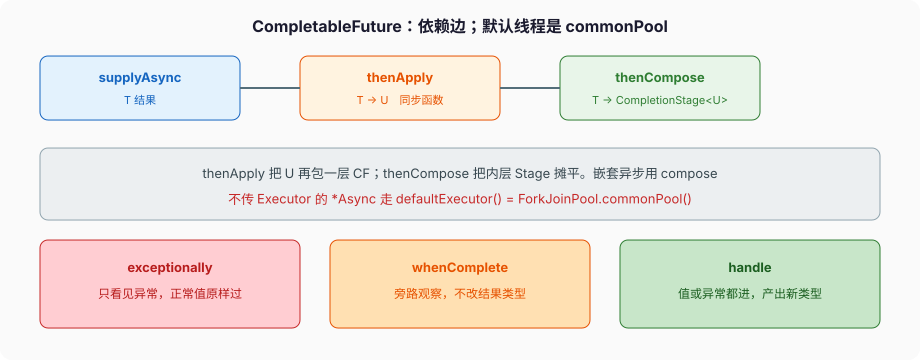

# CompletableFuture

```java
CompletableFuture<String> f = CompletableFuture.supplyAsync(() -> fetch());
String s = f.join();
```

`supplyAsync(Supplier)` 不传 `Executor` 时，跑在 `defaultExecutor()`：**`ForkJoinPool.commonPool()`**。并行流、默认的 `CompletableFuture`、不少库的「异步」，抢的是同一池。池的并行度大约 `availableProcessors() - 1`。`fetch()` 若是 HTTP，common pool 的平台线程会在阻塞 I/O 上坐穿，别的 `parallelStream` 一起停。

这不是「异步」三个字能遮住的。CF 是依赖图：每个完成的结果（或异常）沿边触发后继。边怎么接、异常走哪条 API、线程在哪个池，三件事分开看。



---

## 一、完成：正常、异常、取消

`complete(v)` 把结果钉成 v，返回是否抢到「第一次完成」。`completeExceptionally(ex)` 钉成异常。已经完成的再 complete，返回 false，值不变。`obtrudeValue` / `obtrudeException` 强制覆盖，只给恢复工具用，业务别用。

`join()`：完成则返回值；异常完成则抛 `CompletionException`（unchecked），cause 是原异常。`get()` 抛 `ExecutionException`（checked）或 `InterruptedException`。能用 `join` 的地方不要 `get` 只为了少写 throws——你是在选异常类型，不是选功能。

`cancel(true)` 对 CF **不中断** 正在跑的任务（`mayInterruptIfRunning` 被忽略）。它把 CF 标成 `CancellationException` 完成。跑在池里的 `Supplier` 不知道自己被 cancel，除非你自己查 `isCancelled` 或响应中断。取消链路要自己设计，不要假设 `cancel(true)` 像 `FutureTask` 那样 `interrupt`。

`getNow(fallback)` 没完成就返回 fallback，不阻塞。`getNumberOfDependents` 看有多少后继还没走，调试用。

---

## 二、`thenApply` 不是 `thenCompose`

```java
CompletableFuture<String> id = CompletableFuture.supplyAsync(() -> "u1");

CompletableFuture<Integer> len = id.thenApply(String::length);
// Function<T,U>：同步把 T 变成 U，框架再包成 CF<U>

CompletableFuture<User> user = id.thenCompose(this::findUserAsync);
// Function<T, CompletionStage<U>>：你已经返回一个 Stage，摊平，不要 CF<CF<User>>
```

嵌套异步（查完 id 再查库，库也是 CF）必须 `thenCompose`。写成 `thenApply(id -> findUserAsync(id))` 得到 `CompletableFuture<CompletableFuture<User>>`，`join()` 拿到的还是一个没完成的 CF。这是 CF 第一坑，和 Stream 的 `map` / `flatMap`、Optional 的 `map` / `flatMap` 同一张图。

`thenCombine(other, fn)` 等两个都完成，把两个值送进 `fn`。`thenAcceptBoth` 消费不返回。`runAfterBoth` 两个都完成再跑 `Runnable`。`applyToEither` 谁先完成用谁，另一个的结果丢掉——超时竞赛用这个，要自己处理「慢的那个还在跑」。

`allOf(cfs...)` 返回 `CompletableFuture<Void>`，全部完成（无论正常还是异常）才完成。其中一个异常，`allOf.join()` 抛 `CompletionException`，**其余任务不会自动取消**。要取消得自己 `cancel`。`anyOf` 返回 `CompletableFuture<Object>`，第一个完成的值（或异常）定胜负，同样不取消其余。

---

## 三、异常：三条 API 不是同义词

```java
cf.exceptionally(ex -> fallback);           // 只有异常才进；正常值原样往下
cf.whenComplete((v, ex) -> log(v, ex));     // 旁路，返回类型不变；回调里抛的异常可能盖住原异常
cf.handle((v, ex) -> ex == null ? map(v) : recover(ex));  // 值或异常都进，产出新类型
```

`exceptionally` 相当于「catch 之后给个值」。后面的 `thenApply` 看见的是 fallback，看不见异常。

`handle` 是正规的二路：`v` 和 `ex` 一个非 null（正常时 `ex==null`；异常时 `v==null`，取消时 `ex` 是 `CancellationException`）。用它做恢复或改类型。

`whenComplete` 不要拿来做恢复——它不改变完成值。日志、指标走这里。回调里再抛，21 的行为是可能把原异常 addSuppressed 或替换，不要在这里抛业务异常。

`join()` 把执行期异常包成 `CompletionException`。`exceptionally` 收到的已经是包装还是 cause，取决于链路怎么接；稳妥写法 `ex instanceof CompletionException ? ex.getCause() : ex`。测试里断言类型要剥这层。

---

## 四、哪条线程在跑你的回调

命名规则：

- `thenApply(fn)`：**可能** 在完成 `complete` 的那个线程里直接跑 `fn`（如果当时后继已经挂上）。也可能在你调 `thenApply` 的线程里跑（如果已经完成）。没有强制池。
- `thenApplyAsync(fn)`：不传 Executor 就 `defaultExecutor()`，即 **commonPool**。
- `thenApplyAsync(fn, executor)`：你指定的池。

「异步」三个字在 CF 里经常只是 `*Async`。`thenApply` 跟着 `supplyAsync` 不等于回调也在池里——完成线程可能把后继内联跑完。回调里再做阻塞 I/O，完成线程（可能是 commonPool worker，也可能是 `complete` 的业务线程）被占住。

21 正确接虚拟线程：

```java
Executor vt = Executors.newVirtualThreadPerTaskExecutor();
CompletableFuture<String> f = CompletableFuture.supplyAsync(this::fetch, vt);
CompletableFuture<String> g = f.thenApplyAsync(this::parse, vt);
```

不要 `supplyAsync(fetch)` 默认池，再幻想虚拟线程会来救。并行流也用 commonPool：CF 默认执行器和 `parallelStream` 叠加，是同一颗地雷。Stream 篇写过这条，这里是另一根引线。

`orTimeout(3, SECONDS)` 超时以 `TimeoutException` 异常完成，**不取消** 原任务。`completeOnTimeout(fallback, 3, SECONDS)` 超时用 fallback 正常完成，原任务仍可能跑完再 `complete` 失败（已经完成，返回 false）。超时要停 I/O，自己在任务里查 `isDone` / 中断 / 取消 HTTP 客户端。

---

## 五、和 `Future`、虚拟线程的边界

`CompletableFuture` 实现 `Future`。`ExecutorService.submit` 返回的是 `FutureTask`，不能 `thenApply`。要编排，从一开始用 CF，或 `CompletableFuture.supplyAsync(..., executor)`。

I/O 密集、步骤是线性的「读-算-写」，Java 21 用虚拟线程同步写往往更短：

```java
try (var exec = Executors.newVirtualThreadPerTaskExecutor()) {
    String user = exec.submit(() -> loadUser(id)).get();
    String order = exec.submit(() -> loadOrder(user)).get();
}
```

这没有 CF 的依赖图。需要 **并发两个 I/O 再汇合、超时竞赛、某个失败整图取消**，才上 CF，并且每个 `supplyAsync` 都把 executor 传成虚拟线程池或专用平台池。

CPU 密集拆分仍用 `ForkJoinPool`（可以自己 new，别用 common 和业务 I/O 混）。虚拟线程不让 CPU 更快。

---

## 六、完整走一遍：默认池被 HTTP 打满

```java
List<String> urls = loadUrls();                 // 200 个
List<CompletableFuture<byte[]>> fs = urls.stream()
        .map(u -> CompletableFuture.supplyAsync(() -> httpGet(u)))
        .toList();
CompletableFuture.allOf(fs.toArray(CompletableFuture[]::new)).join();
```

1. 每个 `supplyAsync` 把任务丢进 commonPool。并行度 ~ CPU-1。
2. `httpGet` 阻塞。worker 全部卡在读 Socket。
3. 同一 JVM 的 `parallelStream`、其他默认 CF、`ForkJoinPool.commonPool().submit` 全部排队。
4. `allOf.join()` 等 200 个 HTTP。其中一个超时抛到 `join`，另外 199 个仍在跑，没有自动取消。
5. 改法：`supplyAsync(() -> httpGet(u), vtExecutor)`；超时用 HTTP 客户端自己的 timeout，再加上 `orTimeout` 只作为编排层的截止；失败时对 `fs` 逐个 `cancel(true)` 并在 `httpGet` 里响应中断。

把 `httpGet` 换成纯 CPU 哈希，commonPool 才是对的工具。I/O 和默认执行器叠在一起，是把线程池模型用错。

---

## 七、反模式

- `supplyAsync(blockingIo)` 不传 Executor。
- `thenApply(x -> otherCf(x))` 得到 CF&lt;CF&lt;T&gt;&gt;，该用 `thenCompose`。
- `allOf` 失败当「其余任务已经停了」。
- `cancel(true)` 当中断。CF 不中断在跑的 Supplier。
- `whenComplete` 里抛异常当恢复。
- `thenApply` 回调里再做 HTTP，占住 `complete` 的那个线程。
- 和 `parallelStream` 同时打满 commonPool，再怪 GC。
- `orTimeout` 当取消 I/O。它只让 CF 异常完成。

下一篇把 Selector 和虚拟线程阻塞 I/O 的边界钉完。CF 解决任务图；连接怎么读字节，21 默认已经不是「必须 NIO 多路复用」。
