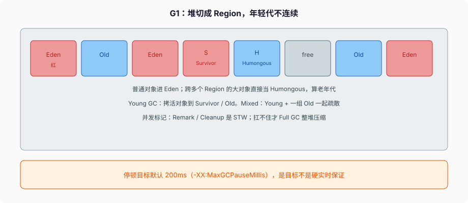

# JVM 与垃圾回收

`new` 出来的对象，规范只保证它是引用类型的实例，活在共享的堆上。堆怎么切、对象头几个字节、哪次 GC 停多久，是 **HotSpot 的实现**，不是 JLS。面试把实现细节说成语言规则，是错的；把实现细节说成「大概」，也是错的。这篇按 JVMS 21 的运行时数据区讲规范部分，按 HotSpot 21 / G1 调优文档讲实现部分，两层分开。

---

## 一、运行时数据区（JVMS §2.5）

### 1、规范列了这些

**PC 寄存器。** 每条 JVM 线程一个。线程在跑 Java 方法时，PC 是当前指令地址；跑 native 时，PC 未定义。

**Java 虚拟机栈。** 每条线程一块，和线程一起创建。存的是 **帧**。帧在方法调用时建、返回或没接住的异常时毁。规范说栈内存不必连续，帧甚至可以分配在堆上——实现自己决定。HotSpot 默认还是每线程一块栈，`-Xss` 调大小，撑满抛 `StackOverflowError`；要扩展抛不出时是 `OutOfMemoryError`。虚拟线程的栈是堆上的 continuation，不走这块固定 `-Xss`，这是 21 的实现，规范没改「每线程一块 JVM 栈」的模型。

**堆。** 所有线程共享。对象实例、数组在这里。`OutOfMemoryError` 和堆相关的那条从这里来。GC 管的就是这块。

**方法区。** 所有线程共享。按类存运行时常量池、字段和方法数据、方法/构造器的代码，包括类初始化、实例初始化那些特殊方法。JVMS 把方法区说成逻辑区域；HotSpot 8 起类元数据在 **Metaspace**（本地内存，不在 Java 堆里），字符串常量池在堆上。别把「永久代」拿到 21 来说——PermGen 在 8 已经没了。Metaspace 默认几乎不设上限（受本地内存限制），类泄漏表现为进程 RSS 涨、`Metaspace` OOM，不是 Java 堆 OOM。

**运行时常量池。** 每个类一份，从 class 文件常量池来，解析过程会把符号引用变成直接引用。`String.intern` 跟堆上的字符串池有关，不是这份常量池本身。别把「常量池」三个字混成一个东西。

**本地方法栈。** 给 `native` 用，也是每线程。实现可以和 JVM 栈合成一块。HotSpot 大体是这样。JNI 调 C 函数爆栈，错误可能表现为 `StackOverflowError` 或直接把进程打崩，取决于 C 侧。

### 2、帧里三件套（§2.6）

局部变量表、操作数栈、当前类的运行时常量池引用。`int` / 引用占局部变量表 1 槽，`long` / `double` 占 2 槽。字节码 `iload` / `istore` / `iadd` 围着这两块转。`javap -c` 看见的 `#2` 是常量池索引，不是行号。

逃逸分析把未逃逸对象拆成标量，是 JIT 在这套模型上的优化，语言规则仍当对象在堆上。`-XX:-DoEscapeAnalysis` 能关。正确性按堆对象来：`synchronized`、身份哈希、`==` 仍按对象语义。

---

## 二、对象在堆上长什么样（HotSpot）

### 1、对象头

64 位 HotSpot、压缩类指针打开时（21 默认常见配置）：对象头是 **mark word 8 字节 + klass 指针 4 字节**。数组再加 4 字节 length。字段按对齐规则排，对象整体对齐到 8 字节。压缩 oops 打开时，堆上的引用常是 4 字节，堆上限大约 32GB 量级；再大就关压缩，引用变 8 字节，对象整体变胖。

空对象 `new Object()` 在这种配置下常是 16 字节（12 头 + 4 对齐）。`Integer` 除了头还有 4 字节 `value`，对齐后 16。`int` 字段 4 字节，`Integer` 字段 4 字节（压缩 oops）指向 16 字节对象——所以热路径 `ArrayList<Integer>` 比 `int[]` 胖一个数量级不止。

mark word 里塞：哈希码（第一次调 `System.identityHashCode` / 默认 `hashCode` 才算，算完写回）、GC 分代年龄、锁状态。`synchronized` 锁的就是这块，不是旁边另开一把独立的锁对象——所以 `synchronized (x)` 和 `x` 的身份绑死。算过 identity hash 之后，有些锁膨胀路径会受影响（实现细节，不要当优化手段去碰 identity hash）。

这些数字随是否压缩、是否 32 位、是否开了 Lilliput 实验而变。面试答「对象头 12 字节」要补一句前提；答「规范规定 12 字节」直接错。

### 2、分配

线程本地 TLAB（Thread-Local Allocation Buffer）从 Eden 切一小块，`new` 大多是 bump pointer，打满再向堆要。TLAB 是实现，规范不管。大对象可能不走 TLAB，直接占 Eden 或 Humongous。

逃逸分析 + 标量替换：方法里 `new Point(1,2)` 若没逃出，可能变成两个 `int` 局部变量，看起来「没分配」。JFR 的 Allocation 事件会少。不要用「我 new 了所以一定有 GC」反推，也不要依赖「一定没有分配」写正确性。

---

## 三、分代假说和对象往哪去

多数对象朝生夕死，活过几次 Young 的才可能长寿。这是分代收集的依据，不是定理。缓存、连接、类元数据、intern 字符串不服从这条，堆会被它们堆在 Old / Metaspace 里。

分配路径（HotSpot + G1）：

1. 线程从自己的 TLAB bump pointer。TLAB 来自某个 Eden Region。
2. TLAB 满了，向 G1 要新的 Eden Region 再切一块。年轻代到阈值，Young GC。
3. 活着的对象拷到 Survivor。年龄（mark word 里）+1。默认 15 附近晋升 Old。Survivor 装不下也会提前晋升（allocation / evacuation failure 的近亲）。
4. ≥ 半个 Region 的对象不走这条，直接 Humongous，逻辑上算 Old。

晋升过快（年龄还小就进 Old）是 Mixed / Full 的温床：Young 太小、Survivor 太小、大对象太多。日志里看 `AgeTable` 和晋升量，不要只看停顿数字。

`PretenureSizeThreshold` 在 Parallel 上能让大对象直接进 Old；G1 用 humongous 规则，不要拿 Parallel 的参数套 G1。

---

## 四、G1：堆切成 Region

JDK 9 起服务端默认收集器是 G1，21 仍然是。文档对 G1 的定性：generational、incremental、parallel、mostly concurrent、stop-the-world、evacuating，并且在每次 STW 里盯着停顿目标。



### 1、Region 和 Humongous

堆被切成大小相同的 Region。年轻代（Eden + Survivor）和老年代在地址上 **不必连续**——一排 Region 里红的是 Eden、蓝的是 Old，中间可以夹着空闲。Region 大小由堆容量算出，或用 `-XX:G1HeapRegionSize` 钉死。常见 1MB–32MB。

**Humongous**：对象大小 **大于等于半个 Region**。它不进 Eden，直接占连续的 Humongous Region，逻辑上算老年代。G1 对 humongous 主要判活、死了就回收；搬走它是非常慢的最后手段。大数组、大 `byte[]` 缓冲区会走这条路。Region 1MB 时，512KB 的数组已经 humongous。连续分配大缓冲区会把堆切碎，Young GC 救不了。

### 2、Young / 并发标记 / Mixed / Full

**Young GC：** STW，把 Eden/Survivor 里的活对象拷到新的 Survivor 或直接进 Old（年龄到了，默认 15 附近）。拷走之后源 Region 变空闲。这就是 evacuate。根是栈、寄存器、JNI、还有 RSet 里记的老到年轻的指针。

**并发标记：** 堆占用到了 IHOP（Initiating Heap Occupancy Percent）附近，Young GC 会带着 Concurrent Start。标记大部分和 mutator 并发。Remark、Cleanup 是 STW。21 默认 **Adaptive IHOP**：G1 自己观察标记要多久、标记期间老年代涨多快，去调阈值；`-XX:InitiatingHeapOccupancyPercent` 在自适应还没学够时当初始值。关掉自适应才是固定百分比。

**Mixed GC：** 空间回收阶段。一次 STW 里既处理年轻代，又疏散一组老年代 Region。挑哪些 Old，看残留垃圾多少（garbage first）。这阶段反复 Mixed，直到再回收老年代不划算，然后回到 Young-only。

**Remembered set：** 每个 Region 记「谁可能指向我」。GC 时要修正被搬走对象的外来指针，靠这个。实现上堆按 card 切，默认 512 字节一张，RSet 存的是 card 索引。年轻代每次都收，RSet 一直维护；老年代候选的 RSet 多半在 Remark 和 Cleanup 之间懒建。RSet 本身占内存，Region 多、跨区指针多，RSet 会胖。这是 G1 相对 Parallel 的开销来源之一。

**Full GC：** 并发标记和 Mixed 扛不住，堆里腾不出对象要的空间，G1 做整堆 STW、原地压缩。文档原话：very slow。看见 Full GC 是事故，不是「G1 的一种正常档位」。to-space exhausted、humongous 分配失败，是常见诱因。

### 3、停顿目标不是 SLA

`-XX:MaxGCPauseMillis`。HotSpot 默认 **200 毫秒**。这是 **目标**，G1 选 collection set 的大小时往这个数上靠，不是硬实时，也不是「每次 GC 都 ≤ 200ms」。设成 20 还不给够堆，只会逼 G1 每次少收一点，最终跟不上分配，掉进 Full GC。

G1 的默认配置既不是纯吞吐、也不是最低延迟，是「相对小而均匀的停顿 + 还过得去的吞吐」。要极致吞吐看 Parallel；要更短停顿、能接受更大堆和更多并发开销，21 里有 ZGC（JEP 377 已正式），那是另一套染色指针，本篇不展开。ZGC 的暂停按毫秒以下设计，代价是更多着色和读屏障，不是免费午餐。

`GCTimeRatio` 默认 12，目标大约 8% 的时间给 GC。这是吞吐侧的软约束，和 MaxGCPauseMillis 一起被 G1 权衡。

---

## 五、引用强度

`java.lang.ref` 把可达性分成档（包文档）：

- 强引用：普通字段、局部变量。活着，GC 不收。
- 软引用 `SoftReference`：内存紧时才收。适合做接近堆上限的缓存，不适合当「保证还在」的存储。HotSpot 会考虑上次 GC 后的空闲量和引用存活时间，具体算法是实现。
- 弱引用 `WeakReference`：下一次发现它弱可达就收。`WeakHashMap` 的 key 是弱引用，GC 后条目没了；文档说它靠 `ReferenceQueue.poll` 在访问时清。
- 虚引用 `PhantomReference`：必须配队列。对象被收回后入队，用来做清理通知。比过时的 `finalize` 可控。
- `Cleaner`：建在虚引用上的清理器，代替 `finalize`。`ByteBuffer.allocateDirect` 的堆外内存靠类似机制回收。

引用对象本身如果都不可达了，它不会入队。要用队列，得有人握着这份 `Reference`。`WeakHashMap` 自己握着。

不要用 `SoftReference` 当连接池。连接的生命周期跟内存压力无关。不要在 `finalize` / `Cleaner` 回调里再分配重对象、再抢锁——那条线程是 JVM 自己的，堵了对整堆引用处理都有影响。

`finalize`：Java 18 deprecated for removal。对象要进 Finalizer 队列，至少多活一轮，吞吐和停顿都差。看见生产代码还覆写 `finalize`，当事故修。

---

## 六、常见参数和该看的日志

日常先动这几个，别一上来抄 30 个 `-XX`：

- `-Xms` / `-Xmx`：堆的起止。生产上两者相等，避免运行中扩堆触发的停顿。
- `-XX:MaxGCPauseMillis`：目标，不是契约。
- `-XX:G1HeapRegionSize`：一般让它自己算。明确要控制 humongous 阈值时再钉。
- `-Xlog:gc*`：21 的统一日志。旧的 `-XX:+PrintGCDetails` 已经走 `Xlog`。
- `-XX:+DisableExplicitGC`：生产常开，避免库里的 `System.gc()` 捅你。

21 的 GC 日志长这样（`-Xlog:gc*` 节选，不是要你背格式，是要认得字段）：

```text
[gc,start] GC(42) Pause Young (Normal) (G1 Evacuation Pause)
[gc]      GC(42) Pause Young (Normal) (G1 Evacuation Pause) 1024M->768M(2048M) 23.456ms
```

- `Pause Young (Normal)`：普通 Young，不是 Mixed，不是 Concurrent Start
- `1024M->768M(2048M)`：GC 前堆占用 → GC 后占用（堆容量）
- `23.456ms`：这次 STW。持续顶着 200ms 目标，才考虑调 Region / 堆 / 代码分配

`Pause Young (Concurrent Start)` 是标记周期的起点。`Pause Young (Mixed)` 是在收 Old。`Pause Full (G1 Compaction Pause)` 是事故。`Humongous allocation` 频繁出现，去查谁在分配大数组。

看日志先看：Young/Mixed 的停顿有没有持续顶到目标、有没有 `Pause Full`、humongous 分配是不是很频繁、to-space exhausted 有没有出现、`Evacuation Failure`。调参没有「通用最优」，对着这一份日志改。

`jcmd <pid> GC.heap_info`、`jstat -gc`、JFR 的 GC 事件，比在代码里猜更准。`jmap -dump` 会 STW，生产上用 JFR 或 `jcmd GC.run` 之前先问清影响。

OOM 时 `-XX:+HeapDumpOnOutOfMemoryError` 能留下 dump。Metaspace OOM 和堆 OOM 不是同一种 dump 能看完的，类泄漏要看 `jcmd VM.classloaders` / NMT。

---

## 七、和分配、并发的交界

`finalizer` 线程、`Reference` 处理线程、G1 的并发标记线程，都是 JVM 自己的线程。`Runtime.availableProcessors()` 不等于「我的业务线程能用的核」。容器里 CPU 限额和这个数对不上时，并行 GC 线程可能过多，21 对容器感知比老版本好，仍要在 cgroup 里核对。

虚拟线程不改变 GC 模型。百万虚拟线程的栈是堆上的 continuation，会增加堆压力。这是用虚拟线程换 I/O 并发时要算的账，不是「虚拟线程不占内存」。

`String.intern` 在 7 之后进堆，不是 PermGen。狂 intern 用户输入等于在堆上做了一份永不释放的字典（除非类卸载把对应常量带走，用户 intern 的走字符串池，更难卸）。不要对请求参数 intern。

---

## 八、安全点、写屏障、收集器怎么选

STW 不是「所有线程立刻停」。HotSpot 要等到每个线程走到 **safepoint**：方法调用/返回、循环回边、JNI 过渡这些 JVM 插了检查点的地方。计数循环 `for (int i = 0; i < n; i++) a += i;` 如果 JIT 把回边检查优化掉，这个线程可能迟迟不到安全点，别人都停了它还在跑——Time to Safepoint（TTSP）会进 GC 日志。这是「停顿 50ms，业务却卡了 200ms」的一种来源。`-Xlog:safepoint` 能看见。

写屏障：mutator 把一个引用字段改掉时，G1 要更新 RSet（老 → 年轻、Region → Region）。这就是为什么 G1 比 Parallel 在 mutator 上更贵。ZGC 用染色指针 / 读屏障，负担换到读路径。不是「G1 没有屏障」。

三选一（21）：

| | Parallel | G1（默认） | ZGC |
| --- | --- | --- | --- |
| 目标 | 吞吐 | 均匀停顿 + 还过得去的吞吐 | 亚毫秒级停顿 |
| 堆形态 | 连续代 | Region | Region + 染色指针 |
| 停顿 | 整代 STW，堆大就长 | 按目标切 collection set | 几乎并发，读屏障 |
| 适用 | 批处理、能忍停顿 | 大多数服务 | 大堆、延迟敏感 |
| 打开 | `-XX:+UseParallelGC` | 默认 / `UseG1GC` | `-XX:+UseZGC` |

别在 4GB 堆、平均暂停已经 30ms 的服务上为了「新」去开 ZGC。测过再换。Serial 给单核 / 客户端小堆，21 服务端不会默认到它。

分配失败：Young GC 之后仍要不出 Eden、humongous 找不到连续 Region、旧对象晋升失败，G1 会尝试更多回收，最后 Full GC，再不行 `OutOfMemoryError: Java heap space`。同一句 OOM 还有 `Metaspace`、`unable to create native thread`（OS 线程打满，虚拟线程之前的经典事故）、`Direct buffer memory`（堆外）。看清后缀再调，不要一律加 `-Xmx`。

---

## 九、JIT：分层、单态调用点、逃逸分析、去优化

HotSpot 默认分层编译。方法/循环回边计数升温：解释器 → C1（带剖析的本地码）→ C2（更狠的优化）。`-XX:-TieredCompilation` 能关，生产没理由关。

**单态调用点（monomorphic inline cache）。** `invokevirtual speak` 在某个调用点如果迄今只见过 `Dog`，JIT 把虚调用变成直接调 `Dog.speak` 并内联。来了第一个 `Cat`，类型假设失败，**去优化** 回解释，再编成双态/多态，内联可能撤掉。热点虚调用「突然变慢」，常见原因是调用点从单态变成多态，不是 GC。

**逃逸分析**三种结果（实现优化，语言规则仍当对象在堆上）：

1. 没逃出方法：可能 **栈上分配**，方法返回就没了，不进 TLAB。
2. 拆成字段： **标量替换**，`new Point(1,2)` 变成两个 int 局部变量，连对象头都没有。
3. 锁对象没逃逸： **同步消除**，`synchronized (new Object())` 整段可以删掉（这种锁本就没意义）。

`-XX:-DoEscapeAnalysis` 关掉之后分配量上去，用来确认是不是 EA 在起作用。正确性不要依赖「一定没分配」：调试、反优化、未升温时仍在堆上分配。

**去优化。** 除了类型假设，还有：没逃逸假设失败（对象其实被存进了堆上的字段）、类层次变了（加载了一个新的子类，CHA 失效）、空指针/除零的罕见路径、断点。去优化把栈从优化帧换成解释帧，继续跑。JFR 的 `Deoptimization` 事件能看见原因。不要把「C2 编过就永远是那份机器码」当定理。

`jstack` 看的是平台线程。虚拟线程要用 `jcmd Thread.dump_to_file` 或 JFR，否则 dump 里只有几条 carrier，看不见一万条堵在 I/O 上的 VT。`TIMED_WAITING` 在平台线程上常是 `sleep`/`wait`/`park`；VT 卸载后 carrier 在跑别人，阻塞的 VT 不占这条平台线程的状态。

---

## 十、完整走一遍：一次 Young GC

1. Eden 的 TLAB 打满，线程向 G1 要新 Region。年轻代占到阈值，触发 Young GC。
2. STW。扫描根：各线程栈帧的局部变量和操作数栈里的引用、JNI 句柄、对应 RSet 里指向年轻代的卡。
3. 活对象拷到 Survivor（年龄 +1）或 Old（年龄到了 / Survivor 装不下）。源 Eden Region 变 free。
4. 修正所有指向被搬走对象的指针。RSet + 根保证能找到这些指针。
5. 恢复 mutator。停顿时间记入日志，G1 用它调整下次 collection set 大小，往 `MaxGCPauseMillis` 上靠。

对象活过足够多次 Young，进 Old。Old 涨到 IHOP，下一次 Young 带 Concurrent Start，后台标记。标记完进入 Mixed，每次捎上几个垃圾多的 Old Region。标记期间分配太猛、空闲跟不上，才 Full GC。

把这条链路说完，比背「新生代伊甸幸存者」三个词有用。G1 的年轻代根本不必在地址上连续，还用「一块连续 Eden」讲 21，是在讲 Parallel / 更早的收集器。

---

## 十一、反模式

- 把 PermGen、CMS 当 21 的默认故事讲。CMS 在 14 移除。
- 看见 Full GC 还觉得「反正会压缩」。
- 把 `MaxGCPauseMillis=20` 当 SLA。
- 用堆缓存（大 `HashMap`）当本地缓存，然后怪 G1 Mixed 停顿。
- `System.gc()` 当释放内存的 API。它只是建议，生产上常被禁用。
- 把对象头字节数说成 JLS 规定。
- 短生命周期反复 `allocateDirect`。
- 对用户输入 `intern`。
- 还覆写 `finalize`。
- 用 `jstack` 查虚拟线程堵在哪。
- 把逃逸分析当语言保证，关了 C2 还假设没分配。

下一篇把类怎么进方法区钉完：加载、链接、初始化、双亲委派、模块。GC 收的是堆上的实例；类本身活在方法区 / Metaspace，卸不卸得掉是另一套规则。
