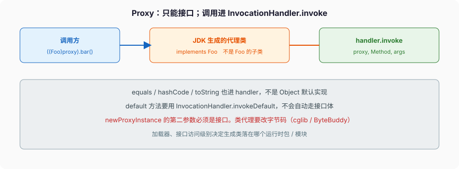

# 反射与动态代理

```java
Class<?> c = Class.forName("com.shop.Driver");
```

单参数 `forName` **会初始化**。驱动类的静态块里如果 `DriverManager.registerDriver`，这行跑完驱动已经挂上了。你以为只是「拿到 Class 对象」，`<clinit>` 已经连了库、读了配置、起了线程。

`Class.forName(name, false, loader)` 才是「只要 Class，不要初始化」。`loader.loadClass(name)` 默认也不初始化。三种拿到 Class 的路，初始化语义不一样，混用是事故。

牛客面经里「反射就是运行时获取类信息」那套百科，下面追一句 `forName` 会不会跑静态块，很多人停住。这篇把三条拿 Class 的路、`getMethod` 和 `getDeclaredMethod` 的查找范围、`setAccessible` 撞模块、`Proxy` 为什么代理不了类、`MethodHandle` 和反射差在哪，按 Java 21 钉死。Spring AOP 只点到「接口走 JDK Proxy，类走改字节码」，不写 Boot。



---

## 一、三份 Class，初始化各不相同

### 1、三种拿到 Class 的路

```java
Class<String> a = String.class;          // 字面量。不触发 String 的 <clinit>（它早就初始化完了）
Class<?> b = obj.getClass();             // 实例已经存在，类一定初始化过
Class<?> c = Class.forName("p.Foo");     // 调用者的加载器；initialize = true
```

`T.class` 不触发 T 的初始化，类加载篇写过：用类字面量、常量变量、`new T[]` 都不在 §12.4.1 的触发列表里。`forName(String)` 等价于 `forName(name, true, currentLoader)`，**会链接并跑 `<clinit>`**。失败是 `ClassNotFoundException`（checked）；`<clinit>` 炸是 `ExceptionInInitializerError`。

```java
class Boom {
    static {
        throw new RuntimeException("clinit");
    }
}

Class.forName("Boom");                   // ExceptionInInitializerError
Class.forName("Boom");                   // 再调：NoClassDefFoundError，不重跑静态块
Class.forName("Boom", false, loader);    // 只要 Class，静态块还没跑
```

类进入错误态之后不会重跑 `<clinit>`。这是 JLS §12.4.2，不是「再试一次就好了」。

### 2、`getMethod` 找得到，`getDeclaredMethod` 找不到，反过来也是

`getMethod(name, paramTypes)`：本类及继承来的 **public** 方法，含父类、接口。找不到 `NoSuchMethodException`。

`getDeclaredMethod(name, paramTypes)`：**本类声明的** 方法，不管 public / protected / 包可见 / private，**不含** 父类继承来的。数组类型上它找不到 `clone()`。

```java
class Parent {
    public void p() {}
    private void hidden() {}
}
class Child extends Parent {
    public void c() {}
}

Child.class.getMethod("p");              // 找得到，public 继承
Child.class.getDeclaredMethod("p");      // NoSuchMethodException，不是 Child 声明的
Parent.class.getDeclaredMethod("hidden");// 找得到，但 invoke 前要 setAccessible
Parent.class.getMethod("hidden");        // NoSuchMethodException，不是 public
```

`getMethods()` / `getFields()` 同样只返回 public，且会从父类、接口收上来，数组里有重复签名的桥方法。`getDeclaredMethods()` 只看本类，含合成的桥、含 private。反射列出「类有哪些方法」时，用错这一对，数目对不上。

字段同一套：`getField` 只 public 继承链；`getDeclaredField` 只本类声明。

构造器：`getConstructor` 只 public；`newInstance()` 在 `Class` 上 9 起 deprecated，走 `getDeclaredConstructor().newInstance()`。无参、抽象类、没暴露的构造器，这里炸。

### 3、`invoke` 的装箱、checked、目标对象

```java
Method m = Foo.class.getMethod("add", int.class, int.class);
Object r = m.invoke(foo, 1, 2);          // 参数装箱成 Integer；返回可能是 Integer
```

基本类型参数用 `int.class` 不是 `Integer.class`——描述符不同，`getMethod("add", Integer.class, Integer.class)` 对不上 `add(int,int)`。返回值若是 `int`，`invoke` 给你装箱后的 `Integer`。目标是实例方法，第一个参数是接收者；静态方法第一个参数传 `null`。

`invoke` 把目标方法抛的 checked 包进 `InvocationTargetException`。你 catch 的经常是这层，真正的业务异常在 `getCause()`。空 catch `InvocationTargetException` 等于把根因吞了。

`Method` 对象可复用，但默认不是并发下随便 `invoke` 的无状态句柄——21 里多数实现已经把部分可变状态拆开，生产上仍不要把「拿到 Method 再 setAccessible」放到热路径每个请求都做一遍。缓存 Method / MethodHandle。

---

## 二、`setAccessible` 撞的是模块，不是「private 三个字」

```java
Field f = Foo.class.getDeclaredField("secret");
f.setAccessible(true);                   // 本模块、未命名模块里的自己的类，通常过
Object v = f.get(foo);
```

Java 9 之后，JDK 内部包默认强封装。对 `jdk.internal`、未 `opens` 的命名模块包调 `setAccessible`，21 抛 `InaccessibleObjectException`。`--add-opens module/package=ALL-UNNAMED` 是逃逸口，不是设计。框架要扫你的私有字段，你的模块得 `opens com.shop.internal to spring.core`。

`AccessibleObject.canAccess` 能事先问。不要假定「private 反射一定能打穿」——那是 8 的世界。

反射改 `final` 字段：JLS §17.5 允许特殊手段改，freeze 发生在这次修改之后。对象被别的线程看见之前必须改完。反序列化走这条路。业务代码反射改 final，可见性按「改完再发布」来，不要改已经发布的单例。

---

## 三、JDK Proxy：只能接口

### 1、生成和调用

```java
interface Foo {
    String bar(int n);
    default String tag() { return "def"; }
}

Foo f = (Foo) Proxy.newProxyInstance(
        Foo.class.getClassLoader(),
        new Class<?>[] { Foo.class },
        (proxy, method, args) -> {
            if (method.isDefault()) {
                return InvocationHandler.invokeDefault(proxy, method, args);
            }
            return "x" + args[0];
        });

System.out.println(f.bar(1));            // "x1"
System.out.println(f.tag());             // 不写 invokeDefault 就不会走到接口体
System.out.println(f.equals(f));         // 进 handler。用 == 自己实现，否则递归
```

文档钉死：接口方法调用编码后进 `InvocationHandler.invoke`。`hashCode` / `equals` / `toString` **也进 handler**，不是 `Object` 的默认实现。handler 里 `proxy.equals(other)` 再调回来，栈溢出。身份比较用 `==`，或 `Proxy.isProxyClass` + 比 handler。

`newProxyInstance` 违反限制抛 `IllegalArgumentException`：必须是接口、可见、不能重复、返回类型冲突要能调和。**不能传入 class。** `newProxyInstance(cl, new Class[]{ ArrayList.class }, h)` 非法。

代理实例 `instanceof Foo` 为 true，`instanceof` 某个具体类为 false。它不是 `FooImpl` 的子类，强转实现类 `ClassCastException`。

### 2、为什么 Spring 有时候换 CGLIB

JDK Proxy 只能接口。目标是具体类、没有接口，运行时改不了它的 vtable。CGLIB / ByteBuddy 生成该类的子类，覆盖方法，等于改字节码。`final` 类、`final` 方法覆盖不了。这就是「类代理」存在的原因，不是「CGLIB 更快所以默认」。

21 里自己做 AOP：有接口走 `Proxy`；没有接口，要么抽接口，要么上字节码库。不要在业务代码里引入 CGLIB 只为了「看起来像 Spring」。

代理类的模块归属：接口全是 public 且导出，代理类在动态模块里；混了非导出、非 public 接口，可访问性跟最严的那个走。跨模块代理失败，先看接口在不在 `exports` / 加载器能不能看见。

### 3、handler 里的异常

`invoke` 抛的 checked 必须是目标方法 `throws` 里声明过的，否则包装成 `UndeclaredThrowableException`。接口方法不抛 `IOException`，handler 却 `throw new IOException()`，调用方接不住 IOException，接到的是 RuntimeException 的子类。签名是契约，反射绕不开。

---

## 四、MethodHandle：描述符对上才能 `invokeExact`

反射的 `Method.invoke` 每次按参数做装箱、权限检查、异常包装。`MethodHandle` 是 JVM 认识的调用目标，`invokevirtual` 链到句柄上，JIT 能内联。

```java
MethodHandles.Lookup lookup = MethodHandles.lookup();
MethodHandle mh = lookup.findVirtual(
        String.class, "substring",
        MethodType.methodType(String.class, int.class, int.class));

String s = (String) mh.invokeExact("hello", 1, 3);   // "el"，描述符必须精确匹配
String t = (String) mh.invoke("hello", 1, 3);        // 必要时 asType 适配
```

`invokeExact`：调用点的符号描述符必须和句柄的 `type()` 完全一致，否则 `WrongMethodTypeException`。`invoke` 在不一致时走 `asType`（或 JIT 等效适配）。两者都是 `invokevirtual`，不是反射的 `Method.invoke`。

`lookup` 的能力取决于谁调的 `lookup()`：本类能找 private；外面只能找它看见的 public / 导出。`privateLookupIn`（9）要模块给权限。别把 `Lookup` 对象传到不可信代码。

`invokedynamic` 的引导方法返回 CallSite，里面就是 MethodHandle。lambda、字符串拼接（Java 9+）、`switch` 的部分实现走这条。面向对象篇说实例方法默认 `invokevirtual`；lambda 不是匿名内部类文件，是 `invokedynamic` + LambdaMetafactory。

热路径：缓存 MethodHandle，不要每个请求 `lookup.findVirtual`。反射热路径更贵，框架初始化阶段反射、调用阶段句柄，是常见拆法。

---

## 五、完整走一遍：一次 JDK 代理调用

```java
interface Repo {
    int save(String id);
}

Repo repo = (Repo) Proxy.newProxyInstance(
        Repo.class.getClassLoader(),
        new Class<?>[] { Repo.class },
        (proxy, method, args) -> {
            if (method.getName().equals("save")) {
                return ((String) args[0]).length();
            }
            if (method.getName().equals("toString")) {
                return "RepoProxy";
            }
            if (method.getName().equals("hashCode")) {
                return System.identityHashCode(proxy);
            }
            if (method.getName().equals("equals")) {
                return proxy == args[0];
            }
            throw new UnsupportedOperationException(method.getName());
        });

int n = repo.save("ab");                 // 2
```

`repo.save("ab")` 一次调用，handler 收到的参数：

| | 值 |
| --- | --- |
| 字节码 | `invokeinterface Repo.save` |
| `proxy` | 代理实例自己（`== repo`） |
| `method.getName()` | `"save"` |
| `method.getReturnType()` | `int.class` |
| `args` | `new Object[]{"ab"}`（引用，不装箱） |
| handler 返回 | `Integer.valueOf(2)`，代理类拆箱 `ireturn` |

`equals` 漏处理时的表。handler 只写了 `save`，`m.put(repo, "x")` 会调 `repo.hashCode()` → 再进 `invoke`。若 `hashCode` 里写 `proxy.hashCode()`，递归直到 `StackOverflowError`。若 `hashCode` 恒 0、`equals` 走 `method.invoke(proxy, args)` 再进 handler，同样递归。正确：`equals` 用 `==`，`hashCode` 用 `System.identityHashCode(proxy)`。

`forName` 两次：

```java
class Boom { static { throw new RuntimeException("clinit"); } }
```

| 调用 | 结果 | 类状态 |
| --- | --- | --- |
| `forName("Boom")` 第一次 | `ExceptionInInitializerError`（cause 是那条 RuntimeException） | 错误态 |
| `forName("Boom")` 第二次 | `NoClassDefFoundError` | 仍错误，**不重跑** `<clinit>` |
| `forName("Boom", false, loader)` 在第一次之前 | 只拿到 Class，静态块还没跑 | 未初始化 |

改一行：`newProxyInstance` 第二参数换成 `new Class<?>[]{ ArrayList.class }` → `IllegalArgumentException`。只能接口。

下一篇把 AQS 的 `state` 和那条 FIFO 钉完。反射解决的是「运行时找到方法」；锁竞争时线程睡在哪条队列上，是同步器的事。
