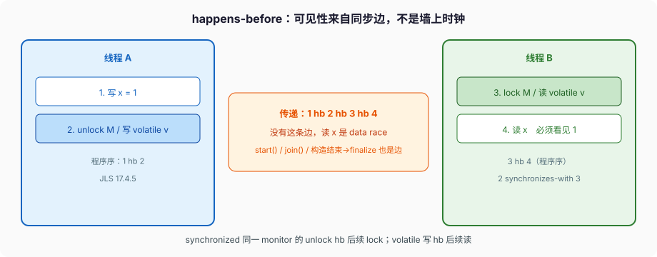
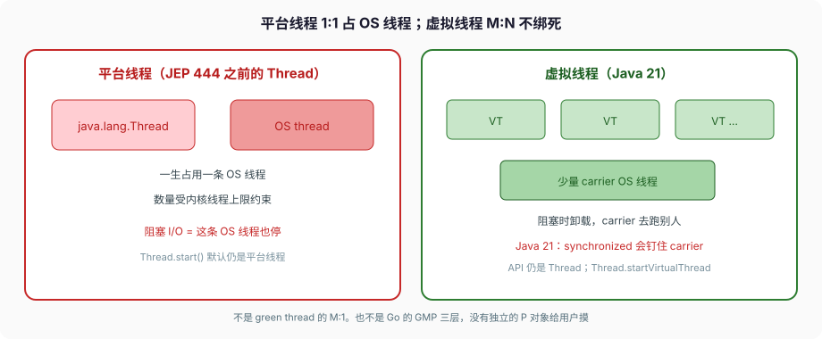

# 并发与内存模型

两个线程，一个写 `x = 1`，一个读 `x`。墙上时钟里写在读前面，读到的仍可能是 0。

这不是 JVM 抽风。JLS §17.4.5 第一句：If one action happens-before another, then the first is **visible to and ordered before** the second。没有这条边，规范允许读到旧值，也允许读到新值。面试里说「加了 volatile 保证可见性」——可见性从哪来的，就是这条边。



C++ 有自己的 memory model（`memory_order_*`），Go 的 happen-before 写在内存模型文档里，Python 因为 GIL，字节码之间多数时候看起来像串行。Java 的模型钉在 JLS 17，跟 HotSpot 怎么实现无关——实现必须遵守，你可以按规范推理。

---

## 一、冲突、data race、正确同步

同一变量，至少一个是写，两次访问就 **冲突**（§17.4.1）。两次冲突访问之间没有 happens-before，程序就有 **data race**（§17.4.5）。

规范给了一条总闸：程序 **correctly synchronized**，当且仅当所有顺序一致（sequentially consistent）的执行里都没有 data race。一旦正确同步，**所有执行看起来都是顺序一致的**（§17.4.3）。这句话的用处：你不用去想 CPU store buffer、不用去想 JIT 怎么重排——锁配对了、volatile 配对了，按源码顺序推理就合法。

没正确同步，happens-before 一致的执行可以不是顺序一致的。规范自己的例子（Table 17.4.5-A）：

```text
线程1          线程2
B = 1;         A = 2;
r2 = A;        r1 = B;
```

初始 `A == B == 0`。可以观察到 `r1 == 0 && r2 == 0`。按程序序各自写了再读，顺序一致下至少有一个能看见对方的写；没有同步边，规范允许两边都看见初始值。这就是「可见性」三个字在规范里的反例。

data race 不能让数组 `length` 读错，也不能让虚方法分派跳到随机地址——这些不是 inter-thread action，规范单独保护（§17.4）。data race 能让你看见过期字段、半截 `long`、对象「构造完了但字段还是默认值」。

---

## 二、happens-before 边从哪来

§17.4.5 加上 §17.4.4 的 synchronizes-with，后端日常用得到的边就这些：

**程序序。** 同一线程里，源码前面的动作 hb 后面的。`x = 1; v = true;` 在这个线程里，写 `x` hb 写 `v`。

**锁。** 对同一 monitor `m` 的 unlock **synchronizes-with** 后续（按 synchronization order）对 `m` 的 lock。因此 unlock hb 后续 lock。`synchronized (m)` 退出时做 unlock，下一次进入做 lock。传递之后：线程 A 在临界区里写的字段，线程 B 进同一把锁之后读，必须看见。

**volatile。** 对变量 `v` 的写 synchronizes-with 后续任意线程对 `v` 的读。因此写 hb 后续读。注意是 **同一个字段**。写 `volatile ready` 并不能单独让另一个字段变可见——要靠程序序 + 传递：线程 A 先写普通字段 `x`，再写 `ready`；线程 B 读到 `ready == true` 之后再读 `x`，才有 `写 x hb 写 ready hb 读 ready hb 读 x`。

**start。** `t.start()` hb 被启动线程里的任何动作。

**join。** 被 join 的线程里所有动作 hb `join()` 的成功返回。

**默认值。** 每个变量被写成默认值（0 / `false` / `null`）synchronizes-with 每个线程的第一个动作。所以你不会读到「比默认值更脏」的位模式，除非碰上下面说的 64 位撕裂。

**构造器结束 hb finalize 开始。** 别依赖 finalize。Java 18 起 `finalize` 已 deprecated for removal。清理用 `Cleaner` 或 try-with-resources。

**传递。** hb 是传递的。图里 1 hb 2 hb 3 hb 4，所以 1 hb 4。

`java.util.concurrent.locks.Lock` 的文档把内存语义钉死了：成功的 `lock` 等同 monitor 的 Lock 动作，成功的 `unlock` 等同 Unlock。失败的加锁、重入的加锁/解锁，**不要求** 额外的内存同步效果。`ReentrantLock` 和 `synchronized` 在可见性上是同一类边，不是「更强」或「更弱」。

`CountDownLatch` 文档：count 到 0 之前，`countDown()` 之前的动作 hb 另线程成功返回 `await()` 之后的动作。`CyclicBarrier`、`Semaphore`、`Exchanger`、并发容器的单元素操作，各自文档都写了 Memory consistency effects。用 j.u.c 的时候，边在文档里，不要靠猜。

---

## 三、volatile 不是锁，long 可能撕成两半

`volatile` 禁止这个字段上的 data race，给读/写配对一条 hb 边。它 **不是** 互斥。两个线程同时 `volatile int n; n++;` 仍会丢更新——`n++` 是读、加、写三步。要原子加减，用 `AtomicInteger`：`get` 是 volatile 读，`set` 是 volatile 写，`compareAndSet` 是 volatile 读加写（Javadoc 对 VarHandle 的对应写得很清楚）。

JLS §17.7：非 volatile 的 `long` / `double`，一次写在模型里可以当成 **两次 32 位写**。一个线程可能看见「高 32 位来自这次写、低 32 位来自另一次写」。volatile 的 `long`/`double` 读写始终原子。引用类型的读写始终原子，不管指针是 32 位还是 64 位。

共享的 64 位计数器，要么 `volatile long`（只保证原子读写，不保证 `++`），要么 `AtomicLong` / `LongAdder`。`LongAdder` 是分段，`sum()` 不是某一瞬间的精确快照，高频统计用它，分布式账本别用它。

---

## 四、`synchronized`、wait/notify、ReentrantLock

`synchronized` 锁的是对象。`synchronized (x)` 和 `x` 指向的那块对象头上的 monitor 绑定，不是和变量名绑定。`synchronized (new Object())` 每次新对象，等于没锁。`synchronized (SomeClass.class)` 锁的是 Class 对象，全 JVM 同一份（同一加载器下）。

`wait` / `notify` / `notifyAll` 必须持有这个对象的 monitor，否则 `IllegalMonitorStateException`（§17.2）。典型写法：

```java
synchronized (lock) {
    while (!ready) {          // 必须 while，不能 if
        lock.wait();          // 释放 monitor，被唤醒后重新竞争
    }
    // 条件成立，仍持有锁
}
```

用 `if` 会在虚假唤醒（规范允许）或多条件共用一把锁时把不成立的条件当成成立。`notify` 只叫醒一个，叫醒谁不保证；条件复杂就 `notifyAll`。

`ReentrantLock` 可重入，同一线程反复 `lock` 会加持有计数，`unlock` 要配对。文档给的写法是立刻 `try/finally`：

```java
lock.lock();
try {
    // ...
} finally {
    lock.unlock();
}
```

多出来的能力：`tryLock`（立刻返回，**不尊重公平**；要尊重公平用 `tryLock(0, SECONDS)`）、`lockInterruptibly`、超时、`newCondition()` 多路条件。公平锁（构造器 `true`）倾向把锁给等得最久的线程，吞吐通常更差。文档写了：公平不保证调度公平，一个线程仍可能连续拿到锁。

虚拟线程那节会说：Java 21 里 `synchronized` 会钉住 carrier。热路径上长时间阻塞，用 `ReentrantLock`，不是为了「更高级」，是为了能卸载。

不要 `synchronized (lock)` 同时又 `lock.lock()`。`Lock` 实例只是普通对象，锁它的 monitor 和调 `lock()` **没有** 规范上的关系。

---

## 五、final 字段：构造结束才冻结

§17.5.1：构造器 `c` 里写了对象 `o` 的 final 字段 `f`，`c` 退出时（正常或突然）对 `f` 发生一次 **freeze**。另一个构造器被 `this(...)` 调到并写了 final，freeze 发生在 **被调的那个** 构造器结束时。

freeze 之后，通过「正常发布」看见这个对象的线程，读 final 字段必须看见构造器里写入的值。这是 `String`、不可变对象能在无锁下安全发布的规范依据。

构造器里把 `this` 塞进别的线程能看见的地方（静态字段、监听器、启动新线程），叫 **this-escape**。freeze 还没发生，别的线程可能读到 final 的默认值。内部类隐式持有外部 `this`，构造器里启动线程跑这个内部类，是同一类事故。

反序列化、反射改 final：规范允许，freeze 发生在这次修改之后。对象在改完之前不该被别的线程看见。

---

## 六、双重检查：volatile 不是装饰

```java
class Holder {
    private static volatile Holder instance;
    static Holder get() {
        Holder h = instance;
        if (h == null) {
            synchronized (Holder.class) {
                h = instance;
                if (h == null) {
                    instance = h = new Holder();
                }
            }
        }
        return h;
    }
}
```

`new Holder()` 在字节码里是：分配、写字段、把引用赋给 `instance`。没有同步边时，JIT/CPU 可以把「赋引用」排到「写字段」前面。另一个线程看见 `instance != null`，进去读字段，读到默认值。`volatile` 写 `instance` 和读 `instance` 之间有 hb，构造器里的字段写又 hb 这次 volatile 写（程序序），所以读到非 null 引用后读字段是安全的。

去掉 `volatile`，这是教科书级 data race。枚举单例、类初始化（§12.4.2 那把初始化锁）更干净，见类加载篇。能用类初始化就别手写双重检查。

---

## 七、虚拟线程：还是 `Thread`，不绑死 OS 线程



JEP 444 原文：platform thread 是 `java.lang.Thread` 的传统实现，**一生占用** 一条 OS 线程；virtual thread 也是 `Thread` 的实例，跑在 OS 线程上，但 **不** 把这条 OS 线程占到代码结束。很多虚拟线程可以先后跑在同一条 OS 线程上。调度器当前指派的那条平台线程叫 **carrier**。虚拟线程一生可以换 carrier，对 Java 代码来说，`Thread.currentThread()` 永远是虚拟线程自己，看不见 carrier；两边的栈、ThreadLocal 互不可见。

创建：

```java
Thread t = Thread.ofVirtual().name("v-1").start(task);
Thread.startVirtualThread(task);          // 等价 ofVirtual().start
try (var exec = Executors.newVirtualThreadPerTaskExecutor()) {
    exec.submit(task);                    // 每个任务一条虚拟线程
}
```

`new Thread(task).start()` 仍是平台线程。`Thread` 的公开构造器只造平台线程。

JEP 444 写得很硬：**Do not pool virtual threads**。池是用来分享贵的东西的，虚拟线程不贵，没有理由池化。从旧的线程池迁过来，迁到 virtual-thread-per-task 的 `ExecutorService`，不是把池子里的平台线程换成虚拟线程继续池。

阻塞 I/O（Socket、多数 File API）会把虚拟线程从 carrier 上卸下来，carrier 去跑别人。Java 21 里 **钉住** carrier、卸不下来的两种情况（JEP 444）：

1. 正在执行 `synchronized` 方法或块；
2. 正在执行 `native` 方法或 foreign function。

钉住不会让程序算错，会让可扩展性变差：虚拟线程在 `synchronized` 里做 `BlockingQueue.take()` 或 I/O，carrier 和底下的 OS 线程一起停。调度器 **不会** 为了钉住去扩并行度。热路径、长时间阻塞，把 `synchronized` 换成 `ReentrantLock`。偶发的、只护内存操作的 `synchronized` 不用换。

`Object.wait()` 和部分文件系统调用，Java 21 也不会卸载。这些实现会临时把调度器 `ForkJoinPool` 的平台线程数抬到超过处理器数来补偿。这是实现细节，不要当成「wait 和 I/O 一样廉价」。

虚拟线程不是把 CPU 算得更快。CPU 密集仍是一条虚拟线程占一个 carrier，和平台线程打满核没本质区别。它解决的是「线程数被 OS 线程上限卡住」的 I/O 并发。Go 的 goroutine 是同类问题的另一种实现；Java 21 把这层露成仍然叫 `Thread` 的 API，旧代码不用换类型。

`ThreadLocal` 在虚拟线程上语义还在，但百万条虚拟线程各自一份 ThreadLocal，内存会炸。JEP 444 之后的方向是约束 ThreadLocal 的使用；21 里你自己别在虚拟线程上当缓存用。

---

## 八、和三门语言对照

| | C++ | Go | Python | Java |
| --- | --- | --- | --- | --- |
| 可见性依据 | memory model / atomic | happen-before 文档 | 多靠 GIL | JLS 17 happens-before |
| 锁 | `std::mutex` | `sync.Mutex` | `threading.Lock` | monitor / `ReentrantLock` |
| 轻量线程 | 无标准 | goroutine M:P:N | 无（有解释器线程） | 21 起虚拟线程 M:N |
| 原子 64 位 | `std::atomic` | 对齐后一般原子 | int 任意精度 | 非 volatile `long` 可撕裂 |

---

## 九、反模式

- 靠「我测了一万次都看见了」证明没 data race。规范允许的交错，测试可以十年不出现。
- `volatile` 当锁，对 `n++`。
- `synchronized (new Object())`。
- `wait` 不用循环包。
- 构造器里启动线程、注册监听器，把没 freeze 的 `this` 发布出去。
- 双重检查不加 `volatile`。
- 给虚拟线程做池。
- 虚拟线程热路径里 `synchronized` 包着 I/O。
- `Thread.stop` / `suspend` / `resume`。早就拆了，21 里是死 API。

下一篇把堆、对象头、G1 的 Region 和 Full GC 钉完。并发写出来的对象，最终都要落到那块堆上。
