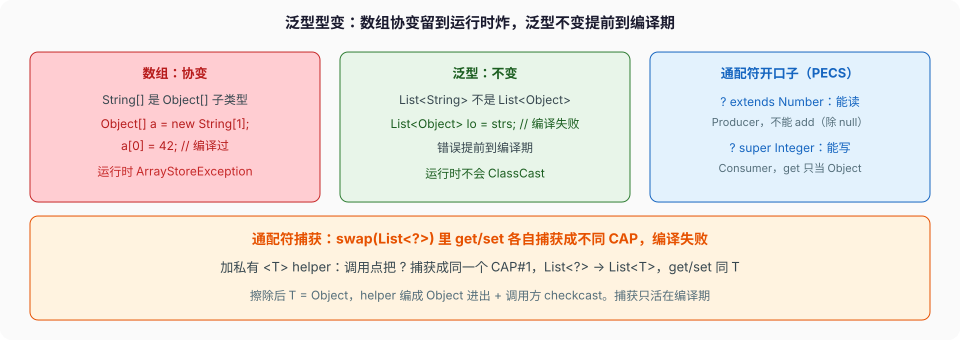

# 泛型与类型系统

```java
static void swap(List<?> list, int i, int j) {
    list.set(i, list.get(j));   // 编译失败
}
```

`list.get(j)` 的类型是 `capture of ?`——编译器给通配符起的一个临时名字，你写不出来。`list.set(i, ...)` 要一个「和这个 capture 相同」的类型，但编译器不敢确认传进去的就是那个 capture，于是拒绝。这不是编译器蠢，是通配符按定义放弃了「元素具体是什么类型」这条信息。

集合篇把「擦除、PECS、桥方法」点过。这篇把类型系统单独拎出来走一遍：擦除到底擦成什么、可具体化类型、型变的三条边、通配符捕获为什么要一个私有 helper、类型推断在钻石和 `var` 里各推什么、递归泛型 `<E extends Enum<E>>`、反射怎么绕过擦除拿到真实类型参数。事实对 JLS 21 第 4 / 5 / 8 / 18 章。



---

## 一、擦除擦成什么，可具体化是什么

JLS §4.6：泛型在编译后做 **类型擦除**。`List<String>` 和 `List<Integer>` 擦成同一个原始类型 `List`；类型变量 `T` 擦成它的 **最左边界**（没写就是 `Object`，`<T extends Number & Comparable<T>>` 擦成 `Number`）。

```java
List<String> a = new ArrayList<>();
List<Integer> b = new ArrayList<>();
System.out.println(a.getClass() == b.getClass());   // true，运行时都是 ArrayList
```

**可具体化类型（reifiable，§4.7）**：运行时能完整表示的类型。`String`、`List<?>`、`Map<?, ?>`、`int[]`、`List[]` 是；`List<String>`、`T`、`List<? extends Number>` 不是。规则从这里长出来：

| 想做的事 | 行不行 | 为什么 |
| --- | --- | --- |
| `new T()` / `new T[n]` | 不行 | 擦除后不知道 T 是什么，`new` 需要具体类 |
| `new List<String>[10]` | 不行 | 数组要记运行时分量类型，`List<String>` 不可具体化 |
| `o instanceof List<String>` | 不行 | 运行时只有 `List`，只能 `instanceof List<?>` |
| `o instanceof List<?>` | 行 | `List<?>` 可具体化 |
| `catch (T e)` / `class E<T> extends Exception` | 不行 | 异常表匹配靠运行时类型，擦除后对不上 |
| 重载 `f(List<String>)` 和 `f(List<Integer>)` | 不行 | 擦完签名都是 `f(List)`，冲突 |

`ArrayList<String>` 的 `get(0)` 在字节码里是 `invokeinterface List.get:(I)Ljava/lang/Object;` 后跟一个 `checkcast String`——泛型的类型安全，运行时靠这层编译器插入的 cast 兜底。`javap -c` 能看见它。

---

## 二、型变：不变、协变、逆变

`List<String>` **不是** `List<Object>` 的子类型（§4.10.2：泛型默认 **不变**）。反证：若是，下面就编得过：

```java
List<Object> lo = someListOfString;   // 假设合法
lo.add(42);                           // Integer 塞进只装 String 的结构
String s = someListOfString.get(0);   // 运行时 ClassCastException
```

数组恰恰犯了这个错——数组 **协变**，`Object[] a = new String[1]; a[0] = 42;` 编译过、运行时 `ArrayStoreException`（入门篇走过）。泛型把这类错提前到编译期，代价是你要用通配符手动开口子：

- `List<? extends Number>`（协变，上界通配）：`? extends Number` 是 `List<Integer>`、`List<Double>` 的公共超类型。能 `get` 成 `Number`，**不能 `add`**（除了 `null`）——因为具体是 `List<Integer>` 还是 `List<Double>` 未知，加什么都可能错。生产者（你从里面读）。
- `List<? super Integer>`（逆变，下界通配）：是 `List<Integer>`、`List<Number>`、`List<Object>` 的公共子类型。能 `add(Integer)` 及其子类，**`get` 只能当 `Object`**。消费者（你往里面写）。

**PECS**：Producer-Extends, Consumer-Super。`Collections.copy(dest, src)` 的签名就是活教材：

```java
static <T> void copy(List<? super T> dest, List<? extends T> src) { ... }
```

`src` 只读（producer，extends），`dest` 只写（consumer，super）。`List<?>` 是 `List<? extends Object>` 的简写，几乎只能读成 `Object`、写 `null`。

---

## 三、通配符捕获：为什么要一个私有 helper

回到开头的 `swap`。修法不是把 `List<?>` 改成 `List<Object>`（那要求调用方真传 `List<Object>`），而是加一个带类型参数的私有方法，让编译器 **捕获** 这个通配符：

```java
static void swap(List<?> list, int i, int j) {
    swapHelper(list, i, j);          // 通配符在这里被捕获成一个具体的 CAP
}

private static <T> void swapHelper(List<T> list, int i, int j) {
    T tmp = list.get(i);             // get 和 set 现在是同一个 T
    list.set(i, list.get(j));
    list.set(j, tmp);
}
```

**捕获转换（capture conversion，§5.1.10）**：`swap` 调 `swapHelper(list, ...)` 时，编译器把 `list` 的 `?` 换成一个 **新鲜的类型变量** `CAP#1`，于是 `List<?>` 变成 `List<CAP#1>` 去匹配 `List<T>`，`T` 推成 `CAP#1`。`swapHelper` 内部 `get` 和 `set` 面对的都是同一个 `T`，编译器能确认「从这个 list 取出的，放回这个 list」类型一致。

直接在 `swap` 里写 `list.set(i, list.get(j))` 不行：两次通配符各自捕获成 **不同** 的 `CAP#1`、`CAP#2`，编译器不认为它们相等。helper 把捕获收敛到一次调用、一个 `T`。这是通配符 API 的标准配套写法，不是绕路。

---

## 四、类型推断：钻石、var、方法各推什么

同样叫「推断」，推的东西不一样。

**钻石 `<>`（§15.9.1）**：从 **目标类型** 推构造器的类型参数。

```java
Map<String, List<Integer>> m = new HashMap<>();   // <> 推成 <String, List<Integer>>
List<String> xs = new ArrayList<>() {};            // 匿名类不能用钻石（Java 8）；9 起能，但推的是父类
```

**`var`（JEP 286，§14.4.1）**：从 **初始化表达式** 推局部变量类型，只能用在局部变量、for、try-with-resources。**不能** 用在字段、方法参数、返回类型、`var x = null`（无从推）、`var lambda = () -> {}`（lambda 没有独立类型）。

```java
var list = new ArrayList<String>();   // ArrayList<String>
var n = 1;                            // int，不是 Integer
for (var e : m.entrySet()) { ... }    // Map.Entry<String, List<Integer>>
```

`var` 不是「动态类型」，类型编译期就钉死，只是你不写。`var n = 1` 是 `int`，`n = "x"` 编译失败。

**方法类型参数 `<T>`（§18）**：从实参、目标类型一起解方程。

```java
static <T> List<T> listOf(T a, T b) { ... }

List<String> s = listOf("a", "b");          // T = String
var x = listOf(1, "a");                     // T = 两者公共超类型：Object & Serializable & Comparable...
List<Number> n = Collections.<Number>emptyList();  // 推不出时显式给 <Number>
```

条件表达式、lambda、方法引用都参与 **目标类型** 推断。`flag ? 1 : 2` 是 `int`；`flag ? Integer.valueOf(1) : 0` 会拆箱，null 时 NPE（入门篇那张三元表）。

---

## 五、递归泛型：`<E extends Enum<E>>`

`Enum` 的声明是 `abstract class Enum<E extends Enum<E>>`。读法：E 是「一个枚举，它的自然序、`compareTo` 都以自己这一族为参数」。这叫 **自限定（self-bounded）**，让 `compareTo(E)` 只接受同一个枚举类型，而不是任意 Enum。

```java
enum Color { RED, GREEN }
// Color 就是 Enum<Color>：compareTo(Color)，不是 compareTo(Enum)
```

同一套用在 builder 上，让链式方法返回子类类型而不是父类：

```java
abstract class Builder<T extends Builder<T>> {
    abstract T self();
    T name(String n) { /* ... */ return self(); }
}
class UserBuilder extends Builder<UserBuilder> {
    UserBuilder self() { return this; }
    UserBuilder age(int a) { /* ... */ return this; }
}

new UserBuilder().name("x").age(1);   // name() 返回 UserBuilder，能接着 age()
```

没有自限定，`name()` 返回 `Builder`，接不上子类的 `age()`。递归泛型把「返回我自己的具体类型」编进类型系统。`Comparable<T>` 常写成 `<T extends Comparable<? super T>>`：允许拿父类的比较器比子类（PECS 的 super 用在这里）。

---

## 六、反射绕过擦除：拿到真实类型参数

擦除擦的是 **对象的运行时类型**，不擦 **类元数据里的 Signature 属性**。字段、方法签名、`extends` 子句里的类型参数，反射能读到。

```java
abstract class TypeRef<T> {}

var ref = new TypeRef<Map<String, Integer>>() {};   // 匿名子类，把类型参数固化进 class 文件
Type t = ((ParameterizedType) ref.getClass()
        .getGenericSuperclass()).getActualTypeArguments()[0];
System.out.println(t);   // java.util.Map<java.lang.String, java.lang.Integer>
```

`new TypeRef<...>(){}` 造了一个匿名子类，`Map<String,Integer>` 被写进 `Signature` 属性。`getGenericSuperclass` 拿到 `ParameterizedType`，从里面掏出真实类型参数。Jackson 的 `TypeReference`、Guava 的 `TypeToken`、Spring 的 `ParameterizedTypeReference` 全是这个「super type token」把戏——绕开擦除告诉框架「我要反序列化成 `Map<String,Integer>` 不是裸 `Map`」。

但 **局部变量 `List<String> x` 的类型参数不进 class 文件**（局部变量的泛型信息编译后没了）。反射只能从字段、方法、超类/接口子句上拿。所以能拿的是「声明处写死的」，不是「运行时对象的」。`new ArrayList<String>().getClass()` 永远是 `ArrayList`，问不出 `String`。

桥方法（§8.4.8.3）也是擦除的产物：`class Box implements Comparable<Box>` 生成 `compareTo(Box)` 和一个合成的 `compareTo(Object)`（`checkcast Box` 后转调），让擦除后的接口 `Comparable.compareTo(Object)` 有实现。反射 `getDeclaredMethods` 两个都在，`isBridge()` 为 true 的不是你写的（面向对象篇有 `javap` 走读）。

---

## 七、走读：capture helper 编译成什么

`swapHelper` 的 `<T>` 擦除后是 `Object`。整段编译成：

| 源码 | 擦除后字节码大意 |
| --- | --- |
| `swap(List<?>, i, j)` | `invokestatic swapHelper(List, int, int)`——`?` 捕获只在编译期，字节码里就是原始 `List` |
| `T tmp = list.get(i)` | `list.get(i)` 返回 `Object`，存进 `Object` 局部 |
| `list.set(i, list.get(j))` | 两个 `Object` 直接 `set`，无 `checkcast`（T 擦成 Object） |
| 调用方 `swap` 里取出元素 | 谁写 `String s = ...` 谁那里插 `checkcast String` |

捕获、`T`、型变，全部在编译期消解成 `Object` + 调用方的 `checkcast`。运行时没有「泛型」这回事——这也是为什么泛型不影响性能（除了装箱），也为什么 `List<Integer>` 每个元素仍要一次装箱（集合篇）。

改一行：把 `swapHelper` 的 `<T>` 上界改成 `<T extends Number>`，擦除从 `Object` 变成 `Number`，字节码里的局部变量类型和 `checkcast` 目标都跟着变 `Number`。上界决定擦成什么，这不是修饰。

下一篇（或集合篇）里 `HashMap<K,V>` 的 K、V 全擦成 `Object`，桶里存的是 `Node`，key/value 字段都是 `Object`——泛型只在 `get`/`put` 的调用点插 cast。类型系统到此。

