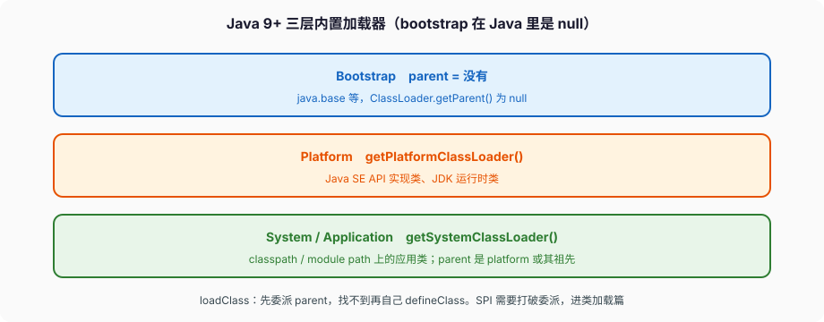

# 类加载与模块

`new Dog()` 能跑，前面一定已经发生过三件事：找到 `Dog` 的二进制、把它链进虚拟机、把类初始化跑完。JLS 第 12 章管这三段叫 loading、linking、initialization。面试里「双亲委派」只是 `ClassLoader.loadClass` 的默认策略，不是这三段本身。



---

## 一、加载：谁 define 了这个 Class

### 1、定义加载器 vs 初始加载器

JLS §12.2：加载是找到某个名字的二进制形式，并构造出代表它的 `Class` 对象。常见来源是 class 文件，也可以是网络、内存里现拼的字节。

`ClassLoader.defineClass` 把字节数组变成 `Class`。真正「这个类是谁家的」看 **定义加载器**（defining loader）：谁调了 `defineClass`，谁就是定义加载器。另一个加载器只是去问了一下、自己没 define，叫 **初始加载器**（initiating loader）。JVMS §5.3 把一个类记成 `<N, Ld>`：名字 + 定义加载器。同一个全限定名，不同定义加载器得到的是不同的 `Class` 对象。`ClassCastException` 在「明明是同一个类」时出现，经常是两个加载器各 define 了一份。

加载约束（JVMS §5.3.4）：两个加载器都声称自己是某个名字的初始加载器时，最终必须指到同一个 Class，否则 `LinkageError`。这是为了让「A 的方法参数类型 T」和「B 传来的 T」是同一个 T。

### 2、内置三层（Java 9 起）

`ClassLoader` 文档：

- **Bootstrap。** 虚拟机自己的加载器，Java 里表现为 `null`，没有 parent。`java.base` 等核心类从这儿来。`String.class.getClassLoader()` 是 `null`。
- **Platform。** `ClassLoader.getPlatformClassLoader()`。Java SE API 的实现类、JDK 运行时类。可以当你自定义加载器的 parent。
- **System / Application。** `ClassLoader.getSystemClassLoader()`。模块路径、类路径上的应用类。parent 是 platform（或其祖先）。类路径上找到的类，进这个加载器的 **未命名模块**。

9 之前是 bootstrap / extension / application。extension 加载器没了，平台类归 platform。面试还答 ext 目录，是在答 8。

### 3、双亲委派是默认实现

`loadClass` 默认委派：先问 parent，parent 找不到再自己找。文档原句：usually delegate the search to its parent class loader before attempting to find the class or resource itself。目的是一份 `java.lang.Object`，不要让应用加载器再 define 一个同名类出来。

自己写加载器：优先重写 `findClass`，让 `loadClass` 的委派还在。整段替换 `loadClass` 且不排除 `java.*`，可以把核心类换成你 classpath 上的假货，验证阶段或加载约束会打你，就算过了也是安全事故。

`registerAsParallelCapable()` 必须在加载器类的静态初始化里调，才能并发加载不同名的类。不登记，`loadClass` 会在加载器实例上加锁，一个类卡住，别的类也等。

### 4、`Class.forName`、TCCL、SPI

`Class.forName("com.foo.Bar")` 用调用者的加载器，并且 **会初始化**。只要 Class 对象不要初始化，用 `Class.forName(name, false, loader)` 或 `loader.loadClass(name)`。

要打破委派：SPI、热加载、框架要隔离插件。`ServiceLoader` 在模块里用 `uses` / `provides`；在类路径上靠 `META-INF/services/`，加载线程的上下文加载器（TCCL）经常掺一脚。TCCL 是线程上的一把钩子，默认继承创建者的，Web 容器爱改它。自己写线程池不传 TCCL 的时候，池里的线程可能看见启动线程的加载器，SPI 就会找错地方——典型症状是 `ClassNotFoundException: com.mysql.cj.jdbc.Driver`，明明 war 里有这份类。

JDBC 4 之后 `DriverManager` 用 `ServiceLoader` + TCCL 加载驱动，不再强制 `Class.forName("...Driver")`。老代码那句 `forName` 是为了触发驱动类的静态块去 `registerDriver`。两种路径混用时，TCCL 不对仍会失败。

### 5、两个失败类型

加载失败：`ClassLoader` 层是 `ClassNotFoundException`（checked）。JVM 解析某个类的符号引用时发现没有，包装成 `NoClassDefFoundError`。编译时有、运行时 classpath 少了一个传递依赖，典型就是后者。`<clinit>` 曾经失败，之后再用这个类也是 `NoClassDefFoundError`（cause 是当初的 `ExceptionInInitializerError`），不会重跑静态块。

---

## 二、链接：验证、准备、解析

JLS §12.3：链接把二进制合进虚拟机运行时状态。三步：

**验证。** 字节码要像合法的 Java 虚拟机语言，不能破坏虚拟机完整性。失败抛 `VerifyError`。手改 class、过旧的字节码增强器，会在这里炸。验证失败后，后续再验证同一份 Class **永远**用同一个错误（JVMS §5.4.1），不会「修了字节再试一次」——要换一份新的 Class 对象（通常意味着新的定义加载器）。

**准备。** 给静态字段分配空间，填 **默认值**（§4.12.5 的 0 / `false` / `null`）。**不跑** 源码里的静态初始化表达式。`static int x = 1;` 在准备阶段是 0，到初始化才变成 1。`static final int x = 1;` 这种常量变量（§4.12.4）更早就进常量池，使用方可能根本不触发类初始化。

**解析。** 常量池里的符号引用变成直接引用。可以懒，用到再解析。失败是 `NoSuchMethodError` / `NoSuchFieldError` / `IllegalAccessError` 这类 `LinkageError`。二进制兼容性（JLS 13）管的是「改了库的 class 但不重编调用方」会不会在这一步炸。删了方法、改了方法签名、把 public 收成 private，都会在解析期以 Error 的形式出现，不是编译期那种红线。

链接总在加载之后。初始化总在链接的验证、准备之后；解析可以夹在初始化前后。

数组类不是从 class 文件加载的，是 JVM 创建的（JVMS §5.3.3）。`String[]` 的定义加载器和 `String` 的定义加载器一致。`int[]` 由 bootstrap 定义。

---

## 三、初始化：那把唯一的锁

### 1、什么触发 `<clinit>`

§12.4.1，类或接口 T 在下面任一事件 **即将发生** 时立刻初始化：

- T 是类，并且要 new 一个 T 的实例
- 调用 T 声明的静态方法
- 给 T 声明的静态字段赋值
- 使用 T 声明的静态字段，且这个字段 **不是** 常量变量

注意：`T[]` 数组 new 出来、用 `T.class` 字面量、用常量变量，**不** 触发 T 的初始化。子类初始化会先初始化超类；接口初始化不会先初始化它的超接口，除非超接口的非常量静态字段真被用到。

```java
class A {
    static final int CONST = 1;          // 常量变量
    static final Integer BOX = 1;        // 不是常量变量，会触发初始化
    static { System.out.println("A clinit"); }
}

int x = A.CONST;                         // 不打印
int y = A.BOX;                           // 打印 A clinit
```

`static final String S = "hi";` 是常量变量。`static final String S = new String("hi");` 不是。

### 2、§12.4.2 的状态机

每个类 C 有一把唯一的初始化锁 LC。实现必须处理两件事——别的线程同时要初始化 C，以及 C 的初始化代码又回头碰到 C。

状态机可以看成四态：已验证已准备但未初始化；正被线程 T 初始化；已完成；错误。同一线程递归碰到「正被我初始化」，把 C 当成已初始化继续走，否则死锁。别的线程在 LC 上等。`<clinit>` 抛异常，类进入错误态，之后再用这个类就是 `ExceptionInInitializerError` / `NoClassDefFoundError`，不会重跑一遍静态块。

这把锁是「饿汉单例」能工作的原因：

```java
class Holder {
    static final Holder INSTANCE = new Holder();
}
```

第一次用 `Holder.INSTANCE` 触发初始化，LC 保证 `INSTANCE` 的写入对后续使用者可见。不必手写 synchronized，也不必双重检查。枚举实例在枚举类初始化时创建，同一套规则。

`<clinit>` 里别做 I/O、别起线程等自己、别依赖别的类的 `<clinit>` 再回头调自己——递归规则让你看见的是默认值，不是「半初始化对象」的友好形态。两个类静态块互相 new，能交出「字段还是 0」的对象。

### 3、死锁现场

线程 1 初始化 A，A 的静态块要初始化 B；线程 2 初始化 B，B 的静态块要初始化 A。两把 LC 交叉等待。这是真实事故，类初始化不该有跨类的重活。发现这种死锁，jstack 能看见线程卡在 `ClassLoader` / `Class.forName` / 静态块第一行。

---

## 四、双亲委派什么时候必须破

委派保证核心类不被替换。要破的现场：

- **SPI。** `DriverManager` 要加载 `classpath` 上的驱动，驱动类不在 bootstrap。JDBC 这条老路用 TCCL。
- **热加载。** 新的定义加载器 define 新字节，旧的加载器连同它 define 的类一起丢掉。类能被卸载的条件很苛刻：这个类的 `Class` 对象、所有实例、定义加载器，都得不可达（JLS §12.7）。加载器泄漏 = 类泄漏 = Metaspace 涨。Tomcat 每个 WebApp 一个加载器，停应用要把加载器上的线程、ThreadLocal、JNI、静态缓存全摘干净，摘不干净就是 permgen/metaspace 泄漏的经典现场。
- **容器隔离。** 每个 Web 应用一个加载器，parent 是容器的公共加载器。应用之间同名类互不可见。子先加载、parent 后加载（Servlet 规范的打破委派）是为了让 webapp 的 `log4j` 盖过容器的。

自己写加载器：优先当 platform 或 app 的子加载器，重写 `findClass` 而不是整段替换 `loadClass`，除非你真的知道要先自己后委派。

---

## 五、模块：JPMS 在加载器上面又加了一层

Java 9 的 JEP 261。一个模块是一组包 + 一份描述（`module-info.java`）。

```java
module com.shop.app {
    requires java.net.http;
    requires com.shop.core;
    exports com.shop.app.api;
    opens com.shop.app.internal to com.shop.framework;
}
```

- `requires`：编译期和运行期都依赖那个模块。`requires transitive` 把依赖转出去。`requires static` 编译期要、运行期可缺。
- `exports`：别的模块可以 **编译期** 引用这些包的公开类型。没导出的包，别的模块源码碰不到。
- `opens` / `open module`：运行期反射可以深访。框架扫注解、设私有字段，需要 `opens`，只 `exports` 不够。
- `uses` / `provides`：模块化的 ServiceLoader。

`java.base` 每个模块都隐式 `requires`。

**未命名模块：** 类路径上的代码活在这里。它读所有模块，也导出自己所有包。所以「把老 jar 丢 classpath」多数时候还能跑。反过来，命名模块默认 **不** 读未命名模块。库一旦模块化，就不能随手 `requires` 一个只在 classpath 上的包。

**自动模块：** 模块路径上没有 `module-info` 的 jar，名字从文件名或 `Automatic-Module-Name` 清单来，导出所有包、读所有模块。这是迁模块路径的过渡态，依赖名字不稳定时不要当稳定坐标。

**分裂包非法。** 同一个包名不能既在命名模块里又在类路径上被当一份用。文档的例子：包在模块里定义了，classpath 上同名包会被忽略。不要靠 classpath 去「补」JDK 里已经模块化的包。

强封装：JDK 内部 API（`sun.*`、`jdk.internal.*`）默认封住。反射打进去要 `--add-opens`，编译期看见要 `--add-exports`。21 已经没有 Java 9 那个 `--illegal-access=permit` 的宽松默认了。反射 `setAccessible` 对未 opens 的 JDK 包会打你。

资源：命名模块里的资源也受封装约束。`ClassLoader.getResource` 对非 `.class` 的资源，包必须无条件 `opens` 才找得到。`.class` 是特例。

应用要不要写成命名模块：新库、要干净依赖边界的，写。一堆老框架靠深反射的单体，先放类路径，在 `module-info` 里一点点 `requires` / `opens`，不要一天切完。

`jlink` 能从模块图裁出一个自定义运行时，少掉用不到的 JDK 模块。这是模块化的收益之一，不是「为了 module-info 好看」。

---

## 六、从 `java` 启动器到 `main`

`java com.shop.App` 大致：

1. 启动器创建内置加载器，按模块路径 / 类路径搭好图。
2. 加载主类、链接、初始化（§12.1）。
3. 调 `public static void main(String[])`。主类没这个方法，`NoSuchMethodError`。签名必须是 `public static void main(String[])`，`static void main(String[])` 少 public 也不行（启动器按这个签名找）。
4. 非 daemon 平台线程都结束（虚拟线程默认不保持 JVM 活着），然后 shutdown hook、清理。

`java -cp app.jar com.shop.App` 走类路径，主类在未命名模块。`java -p mods -m com.shop.app/com.shop.App` 走模块路径。两种模式下，`String` 仍然是 bootstrap 定义的那一份。

`java -jar app.jar` 看清单 `Main-Class`，classpath 是这只 jar，除非清单写了 `Class-Path`。胖 jar 把依赖打进去，是把类路径问题挪到打包期。

---

## 七、完整走一遍：两个加载器各 define 一份

```java
byte[] bytes = Files.readAllBytes(Path.of("out/com/aqjszz/demo/Foo.class"));

ClassLoader l1 = new ClassLoader(null) {     // parent = bootstrap
    @Override protected Class<?> findClass(String name) {
        return defineClass(name, bytes, 0, bytes.length);
    }
};
ClassLoader l2 = new ClassLoader(null) {
    @Override protected Class<?> findClass(String name) {
        return defineClass(name, bytes, 0, bytes.length);
    }
};

Class<?> c1 = Class.forName("com.aqjszz.demo.Foo", true, l1);
Class<?> c2 = Class.forName("com.aqjszz.demo.Foo", true, l2);
System.out.println(c1 == c2);                // false

Object a = c1.getDeclaredConstructor().newInstance();
Object b = c2.getDeclaredConstructor().newInstance();
System.out.println(c1.isInstance(b));        // false
Foo f = (Foo) b;                             // ClassCastException，若 Foo 是应用加载器那份
```

| 表达式 | 结果 | 原因 |
| --- | --- | --- |
| `c1 == c2` | false | 定义加载器不同，两个 Class 对象 |
| `c1.isInstance(b)` | false | b 的 Class 是 l2 那份 |
| `(Foo) b`（Foo 是 app 加载器定义的） | ClassCastException | 消息里会打出两个加载器名字 |
| `a.getClass().getClassLoader() == l1` | true | |

`java.lang.Object` 仍是同一份（parent 都是 bootstrap）。改一行：l2 的 parent 改成 l1，l2 委派后可能直接用 l1 的 Foo，`c1 == c2` 变成 true——前提是 l2 的 `loadClass` 仍先问 parent。热加载要的是 **新的定义加载器 + 新字节**，不是同一个 loader 再 define 一次（同一 loader 同名会 `LinkageError`）。

---

## 八、SPI、TCCL、自定义加载器要写对的那几行

`ServiceLoader.load(Repo.class)` 在类路径上读 `META-INF/services/com.shop.Repo`，用 **线程上下文加载器** 加载实现类。`load(Repo.class, loader)` 才是你指定的加载器。Web 容器把 TCCL 设成 webapp 加载器；线程池 worker 默认继承 **创建池的那个线程** 的 TCCL，不是提交任务的线程。池在启动阶段由 main 创建，TCCL 是应用加载器；任务在请求线程提交，请求线程的 TCCL 是 webapp——worker 里 `ServiceLoader.load` 仍看见启动时的 TCCL，找到容器的驱动找不到 war 里的。

修法：提交任务时把 `Thread.currentThread().getContextClassLoader()` 传进 worker，或 `load(Repo.class, requestLoader)`。JDBC 4 之后 `DriverManager` 也走 TCCL，老代码那句 `Class.forName("com.mysql.cj.jdbc.Driver")` 是为了跑静态块 `registerDriver`。两条路混用，TCCL 不对仍 `ClassNotFoundException`。

自定义加载器优先重写 `findClass`，让 `loadClass` 的委派留着：

```java
final class BytesLoader extends ClassLoader {
    private final Map<String, byte[]> bytes;
    BytesLoader(ClassLoader parent, Map<String, byte[]> bytes) {
        super(parent);
        this.bytes = bytes;
    }
    @Override protected Class<?> findClass(String name) throws ClassNotFoundException {
        byte[] b = bytes.get(name);
        if (b == null) throw new ClassNotFoundException(name);
        return defineClass(name, b, 0, b.length);
    }
}
```

`parent` 用 platform 或 app。`findClass` 只在委派失败后被调，`java.lang.*` 不会进你的字节。热加载：新 `BytesLoader` 实例 + 新字节；旧 loader 上的 Class、实例、ThreadLocal 全部不可达，类才能卸。静态 Map 还握着旧 Class，Metaspace 只涨不跌。

`<clinit>` 交叉：A 静态块 new B，B 静态块 new A，两个线程各拿一把 LC，死锁。jstack 卡在 `Class.forName` 或静态块第一行。类初始化里不要做 I/O、不要起线程等自己。

下一篇把 Stream 流水线、Optional、sealed 和模式匹配 switch 钉完。类加载解决的是类型怎么进 VM；Stream 解决的是类型进了之后，集合上的计算怎么写。
