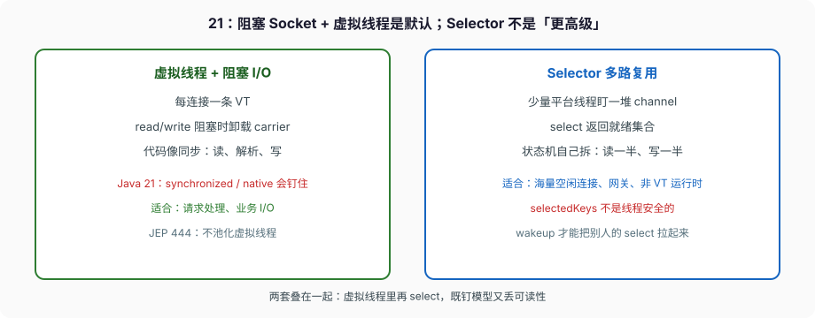

# 网络 NIO 与虚拟线程

`Socket.getInputStream().read()` 在平台线程上等于这条 OS 线程停在内核。C10K 的老答案是：少量线程 + `Selector`，谁就绪处理谁。Java 21 的另一条答案是：每条连接一条虚拟线程，阻塞 `read` 时卸载 carrier，代码按同步来写。

两条都能对。把 Selector 当「更高级的虚拟线程」、或在虚拟线程里再跑一套 Reactor，是把模型叠错。这篇钉三件事：`ByteBuffer` 一次 `write` 写不完；Selector 的循环和 `selectedKeys` 线程不安全；21 下什么时候还需要多路复用。



---

## 一、通道和缓冲：写完要靠循环

异常篇写过 `flip`。网络上多一条：`SocketChannel.write(buf)` **不保证一次写完**。TCP 窗口满、内核缓冲满，返回值可能小于 `buf.remaining()`。

```java
buf.flip();
while (buf.hasRemaining()) {
    int n = channel.write(buf);
    if (n == 0) {
        // 非阻塞模式：此刻写不进去，要等 OP_WRITE
        break;
    }
}
```

阻塞模式（虚拟线程上的默认用法）`write` 会一直堵到能写或炸，循环仍建议写——短写在阻塞模式少见，但 API 合同是「可能短写」。`read` 返回 0 不是 EOF；返回 **-1** 才是对端关了。非阻塞 `read` 返回 0 表示此刻没数据，注册 `OP_READ` 再 `select`。

`ByteBuffer` 的 `position/limit` 是这次读写的窗口。读到一半解析不完，`compact` 把剩余挪到 0 再继续读。`clear` 只改指针，内核不会给你填零。直接缓冲适合长寿命、反复给通道用的缓冲；每请求 `allocateDirect` 会把堆外打满，回收靠 Cleaner，延迟难看。

`SocketChannel` 默认阻塞。`configureBlocking(false)` 之后，没有就绪就 `read`/`write`/`accept` 立刻返回，必须和 Selector（或 `Polling`）配合。虚拟线程上保持阻塞，不要随手改非阻塞。

---

## 二、Selector：少量线程盯一堆 channel

```java
Selector selector = Selector.open();
serverChannel.configureBlocking(false);
serverChannel.register(selector, SelectionKey.OP_ACCEPT);

while (running) {
    selector.select();                       // 阻塞直到就绪、wakeup、或中断
    Iterator<SelectionKey> it = selector.selectedKeys().iterator();
    while (it.hasNext()) {
        SelectionKey key = it.next();
        it.remove();                         // 必须自己摘，否则下次还在
        if (!key.isValid()) continue;
        if (key.isAcceptable()) accept(key);
        if (key.isReadable()) read(key);
        if (key.isWritable()) write(key);
    }
}
```

`select()` 在至少一条就绪、`wakeup()`、或当前线程中断时返回。`selectNow()` 立即返回，并清掉此前 `wakeup` 的效果。`select(timeout)` 的超时按 `Object.wait` 那套调度，**不是实时保证**。

`selectedKeys()` **不是线程安全的**。文档写了。处理必须在 select 的那个线程，或自己同步。处理完不 `iterator.remove()`，这条 key 会留在集合里，下次空转。

`wakeup()`：若有线程正堵在 `select`，立刻返回；若没有，下一次 `select` 立刻返回（除非中间夹了 `selectNow`）。别的线程要关 Selector、改注册，先 `wakeup`，否则 `select` 可能永远不醒。

`SelectionKey` 附 `attachment` 放连接状态（读缓冲、写队列、解码器）。多路复用的本质是 **自己写状态机**：读到一半的 HTTP 头、写到一半的响应，都在 attachment 里。虚拟线程把这台状态机藏进调用栈——这才是两种模型的差，不是性能神话。

`register` 必须在非阻塞 channel 上。阻塞 channel 注册抛 `IllegalBlockingModeException`。已经注册过的再 `register` 是改 interest，不是再加一条。

---

## 三、Java 21：阻塞 I/O + 虚拟线程

JEP 444：多数 JDK 里的阻塞 Socket / File 操作会把虚拟线程从 carrier 上卸下来。于是：

```java
try (var exec = Executors.newVirtualThreadPerTaskExecutor()) {
    ServerSocket server = new ServerSocket(8080);
    while (true) {
        Socket s = server.accept();          // 虚拟线程上 accept 也可卸载
        exec.submit(() -> handle(s));        // 每连接一条 VT
    }
}

void handle(Socket s) throws IOException {
    try (s; InputStream in = s.getInputStream(); OutputStream out = s.getOutputStream()) {
        byte[] buf = new byte[8192];
        int n = in.read(buf);                // 阻塞，VT 卸载
        out.write(process(buf, n));
    }
}
```

这是同步代码。没有 `OP_READ`，没有半包状态机。取消靠关掉 Socket / 中断虚拟线程（读会抛 `InterruptedIOException` 或 `SocketException`，看实现）。

Java 21 钉住：`handle` 里若 `synchronized (monitor) { in.read(...) }`，卸载发生不了，carrier 陪着堵。锁用 `ReentrantLock`，或把 I/O 放到 synchronized 外面。`native` / foreign function 同样钉住。

不要给虚拟线程做池。JEP 原文：Do not pool virtual threads。限流限的是「同时在处理的连接数」或令牌，不是池大小。

---

## 四、什么时候还要用 Selector

还需要的现场：

- **海量空闲连接**（长连接网关、推送、代理）。一百万条连接各自一条虚拟线程，栈和对象头是真内存。Selector 用少量平台线程 + 每连接一个 attachment（通常比一条 VT 的栈小）。要算过再选，不是口号。
- **运行时没有虚拟线程**（老 JDK、限制禁用 VT、某些嵌入式）。
- **必须和非阻塞库对接**（某些纯 NIO 框架、Netty 的 EventLoop）。Netty 自己是 Reactor，不要在 EventLoop 里再起虚拟线程做阻塞调用。
- **一个线程里把 accept/read/write 和定时任务绑在同一条 select 循环**（老式单线程游戏服）。VT 也能做，但那是调度问题，不是 I/O 模型问题。

不需要的现场：普通业务 HTTP 服务、每个请求做数据库/下游 RPC。21 用虚拟线程 + 阻塞 JDBC/HTTP 客户端，比手写 Selector 状态机不容易写错。CF + commonPool + 阻塞 HTTP 是更常见的错法，上一篇写过。

**不要叠：** 虚拟线程里 `configureBlocking(false)` 再 `select`。select 在 21 上可能不卸载（实现相关，且 `Object.wait` 一类不卸载），你同时失去同步代码的可读性和 VT 的扩展性。选一个模型。

---

## 五、`ServerSocketChannel.accept` 和 backlog

`ServerSocket` / `ServerSocketChannel` 的 backlog 是内核 accept 队列上限，不是应用连接数。队列满，客户端看见 `ECONNREFUSED` 或超时，取决于 OS。虚拟线程 `accept` 循环本身能跟上，后面的 `handle` 若慢，连接已经建立，压力在堆和下游，不在 backlog。限流要在 `handle` 入口做，不要靠 backlog 当保护。

`bind(new InetSocketAddress("127.0.0.1", port))` 和 `0.0.0.0` 差在是否对外网卡。练习、管理端口绑本地。

TLS：`SSLSocket` 阻塞 API 在 VT 上同样走卸载（21 的多数路径）。`SSLEngine` 是非阻塞 TLS 状态机，给 Selector / Netty 用。不要在 VT 阻塞模型里手写 SSLEngine，除非你在写网关。

---

## 六、完整走一遍：短写和半包

非阻塞客户端要发 16KB，内核这次只收 4KB：

1. `buf` 里 16KB，`flip` 后 `remaining=16384`。
2. `channel.write(buf)` 返回 4096，`position` 前进，`remaining=12288`。
3. 若当「写完了」去 `clear`，剩下 12KB 丢了。必须要么循环写到 `remaining==0`，要么注册 `OP_WRITE`，就绪再从当前 `position` 继续。
4. 对端一次 `read` 可能只拿到 4KB。应用协议（HTTP 头、长度前缀）必须能拼包。Selector 模型把半包放 attachment；VT 模型用普通 `DataInputStream.readFully` 或自己循环，栈上自然记住「还差多少」。

同一条连接同时要读和写：Selector 把 `interestOps` 设成 `OP_READ | OP_WRITE`，写缓冲空了要去掉 `OP_WRITE` 否则 busy loop。VT 模型两条方向可以在同一条虚拟线程里交替，或拆成读线程/写线程但同一 Socket 的阻塞流不是线程安全的——`InputStream`/`OutputStream` 文档没给你并发合同，读写拆线程要自己同步，或用 `SocketChannel` + 明确的协议。

---

## 七、反模式

- `channel.write(buf)` 只调一次当写完。
- `selectedKeys` 不 `remove`。
- 阻塞 channel 上 `register`。
- 多线程一起搓 `selectedKeys`。
- 虚拟线程热路径 `synchronized` 包着 `read`。
- 给 VT 做池。
- 在 EventLoop / Selector 线程里做阻塞 JDBC。
- VT 里再开 Selector「双保险」。
- 每请求 `ByteBuffer.allocateDirect(1<<20)`。
- 把 backlog 当最大连接数。

进阶宽度补到这里。下面把旧篇里科班还答不出的那些点补上：`javap` 对 boxing、`treeifyBin` 逐步推、JIT 去优化、自定义加载器、手写 Collector。然后实战落到能 `javac` 的 `src/`。
